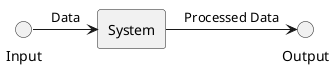

# Ch05 黑箱測試

黑箱測試是在不知道程式內部結構的情況下進行測試。

> **Black-box testing** A method of software testing that examines the functionality of an application without peering into its internal structures or workings.


FIG: 黑箱測試




## 5.1 🧑‍💻Lab: JUnit

<!-- [JUnit](https://hackmd.io/@nlhsueh/HJIj6Ea01e) -->
[JUnit on GitHub](
https://github.com/nlhsueh/sw-testing24/blob/main/lab/u04_utest/intro_junit.md)

## 5.2 邊界測試

> 錯誤都隱藏在角落！！

### 獨立型邊界測試

獨立型邊界測試（Independent Boundary Value Testing）是邊界測試中最基本的測試。這裡所謂的獨立，是系統內的變數彼此獨立，不會聯合起來影響系統的功能或行為。所以如果程式在一個變數邊界的地方寫錯了，錯誤就會彰顯出來，我們不需要特別去測試兩個變數同時在邊界的狀況。

舉例來說，假設一個系統輸入學生的分數與身高，若分數 >=90 則成績為 A，身高若高於 180 則建議參加籃球隊：

```java 
if (s > 90) //應為 >=
   grade = "a";
if (tall > 180)
   exercise = "baseball";      
```

分數與身高兩個變數是獨立無關的，我們無需測試 s=90 同時 tall=180 的邊界測試。像這樣的情況我們可以說「單一錯誤假設」成立：

> **單一錯誤假設** 一個變數的錯誤就足以造成系統的錯誤，不需要同時兩個（或以上）的失誤。

一個系統內會有很多的因子（或變數），邊界測試針對數字性的因子去檢驗其邊界值。假設變數的值在 min, max 範圍之內，則針對因子的邊界值進行測試: min, min+, max, max-, norm。其中 norm 表示 normal 就是在 min 與 max 之間取一個一般的代表值。假設有 n 個變數，每個變數有 min, min+, max, max- 等四個值，再加上一個非邊界的代表值，共是 $4n+1$ 個測試資料。

> 針對每個數字性的因子的邊界：$min$, $min+$, $max-$, $max$ 進行測試。

:::success
考慮一個三角形判斷的程式，輸入三邊長 a, b, c，其邊長介於 1 與 200 之間。輸出為正三角形、等腰三角形、不等邊三角形、非三角形等四種可能。請依據邊界測試設計你的測試案例。
:::

由於有三個變數，我們先固定兩個變數，讓其值為 normal (200)，然後變化另一個變數的值（min, min+, max-, max）。最後再補上一個 normal 的值就完成了。如表所示。


| case\# | a   | b         | c         | 輸出     |
| ------ | --- | --------- | --------- | -------- |
| 1      | 100 | 100(norm) | 1(min)    | 等腰     |
| 2      | 100 | 100(norm) | 2(min+)   | 等腰     |
| 3      | 100 | 100(norm) | 199(max-) | 等腰     |
| 4      | 100 | 100(norm) | 200(max)  | !        |
| 5      | 100 | 1         | 100       | 等腰     |
| 6      | 100 | 2         | 100       | 等腰     |
| 7      | 100 | 199       | 100       | 等腰     |
| 8      | 100 | 200       | 100       | !        |
| 9      | 1   | 100       | 100       | 等腰     |
| 10     | 2   | 100       | 100       | 等腰     |
| 11     | 199 | 100       | 100       | 等腰     |
| 12     | 200 | 100       | 100       | !        |
| 13     | 100 | 100       | 100       | 正三角形 |


這樣一組測試資料是不太夠的，系統規格中有提到要判斷是否為不等邊三角形，但因為我們著重在輸入變數的邊界測試，忽略掉變數的多樣性，只能測試出正三角形或等腰三角形；

解決的方法有兩種：
 
- 隨機的 normal 值。norm 的值不要固定，而是在 min+ 與 max- 之間選一個動態的產出，以提升數值的多樣性。
- 以輸出為基準。不只是以輸入為基礎來設計邊界資料，也把「輸出」考慮在內，規格中的輸出有正三角形、等腰三角形、不等邊三角形、非三角形等四種，設計設計案例使之必定這樣的輸出。

### 獨立型強固邊界測試

強固邊界測試（Robust boundary value testing）擴充一般邊界測試，多考慮例外情況，亦即 min-, max+ 等兩個狀況，所以共測試 $6n+1$ 個狀況。透過檢視系統對例外的處理狀況來檢視系統的強固性。如圖  所示。

同樣以三角形的例子來解說，表中我們新增了兩個測試，分別是 min- 與 max+ 的測試案例。其中 ! 表示例外的輸出。

| case\# | a   | b         | c         | 輸出 |
| ------ | --- | --------- | --------- | ---- |
| 1      | 100 | 100(norm) | 0(min-)   | !    |
| 2      | 100 | 100(norm) | 1(min)    | 等腰 |
| 3      | 100 | 100(norm) | 2(min+)   | 等腰 |
| 4      | 100 | 100(norm) | 199(max-) | 等腰 |
| 5      | 100 | 100(norm) | 200(max)  | !    |
| 6      | 100 | 100(norm) | 201(max+) | !    |
| ...    | ... | ...       | ...       | ...  |
| 19     | ... | ...       | ...       | ...  |

FIG: 強固邊界測試


上述的三角形例子是一個比較單純的例子，每一個變數的合法範圍只有一個，有時候不同的範圍會有不同的輸出，所以就具備多個邊界值。

#### SwimmingPool
:::success
:basketball: 以下是一個游泳池收費系統的規則：
* (1) 一般票價 200 
* (2) 星期六日250元,除會員以外不打折 
* (3) 12歲以下、60歲（含）以上打八折，限定 3-75 歲可入內游泳 
* (4) 七點以前八折
* (5) 團體打七折 
* (6) 會員打五折 
* (7) 各打折不得重疊使用，以顧客最有利方案定價

採用「獨立強固邊界測試」設計測試案例
* 有哪些變數？
* 哪些變數非列舉，有明顯的邊界？其 min, min-, max, max+ 為何？
* 請透過 excel，採用強固邊界測試進行測試案例規劃
* 請透過 JUnit 進行程式碼測試
:::
	
### 非獨立型邊界測試

有一些系統並不符合「*單一錯誤假設*（single fault assumption）」。例如有一個評分系統具備「考試分數 <60 且 作業分數 < 60 則成績為 D，否則為 C」這樣的規則，邊界值為 60, 因此設計出 (60, 80), (80, 60) 的測試案例，兩個的結果都為應為 C。但程式碼犯了錯誤：

```java
grade = "C";
if (exam <= 60 && hw <= 60 ) //錯了
   grade = "D"      
```

我們把 `<` 都打成了 `<=` ，但執行出來的結果一樣是 C，找不出錯誤。如果我們的測試案例都考慮邊界值 (60, 60), 這個錯誤就可以被找出來了。我們之所以用  `(60, 80)` 而非用 `(60, 60)` 來測試是因為我們相信一個 60 的邊界值就足以呈現錯誤（單一錯誤假設），但顯然在某些問題上並不是的。exam 和 hw 並非獨立，他們息息相關，在邏輯的判斷上他們同時出現。

非獨立型一般邊界測試又稱為 *最差情況邊界測試*（worst case boundary value testing）(真倒楣，兩個錯誤同時在邊界時產生)。這種情況，我們就必須用「乘積」的方式來設計測試案例。每一個變數有 min, min+, norm, max-, max 等五種狀況，所以共需要 $5^n$ 個測試案例。這是一個不小的數目，如果有五個變數，則需要 $5^5=3,125$ 個測試案例。表 X 表示三角形程式在非獨立一般邊界測試時的狀況，因為是做乘積，總共會有 `5*5*5=125` 個測試案例。

當變數很多時，其所需要的測試資料數量是我們無法負擔的，所以有時候也進行部分的乘積，而不是全面的，例如我們猜測其中三個高度相關，僅對這三個變數進行乘積，其餘的還是用獨立式的作法。

FIG: 非獨立型強固邊界測試


FIG: 三角形程式：非獨立型一般邊界測試
| case\# | a   | b         | c         | 輸出   |
| ------ | --- | --------- | --------- | ------ |
| 1      | 100 | 100(norm) | 1(min)    | 等腰   |
| 2      | 100 | 100(norm) | 2(min+)   | 等腰   |
| 3      | 100 | 100(norm) | 199(max-) | 等腰   |
| 4      | 100 | 100(norm) | 200(max)  | !      |
| 5      | 100 | 100(norm) | 100(norm) | 正三角 |
| 6      | 100 | 1 (min)   | 1(min)    | !      |
| ...    | ... | ...       | ...       | ...    |
| 125    | ... | ...       | ...       | ...    |

### 非獨立型強固邊界測試

同上，這次我們考慮強固的方案，亦即例外的狀況 max+, min- 考慮進去，所以共需要 $7^n$ 個測試案例，因為每個變數會有以下 7 個資料：

- max+
- max
- max-
- normal
- min+
- min
- min-

當然，這樣的情況測試案例就會更多，以五個變數而言，供需要 $7^5=16,807$ 個測試案例。

### 總結

在設計邊界測試時應該考慮以下因素：
 
- 是否考慮強固性：是否考慮每一個變數的例外。
- 輸入、輸出、或是混和：以輸入的變數作為分割的基準，還是以輸出的變數？還是兩者都考慮？
- 獨立或非獨立：如果是獨立變數，我們的測試案例只要能夠「涵蓋」該邊界即可。若是非獨立，測試案例必須包含所有邊界的「乘積」。

不同的狀況所需建立的測試案例數量有所不同：

- 獨立型邊界測試: $4n+1$
- 獨立型強固邊界測試: $6n+1$
- 非獨立型邊界測試: $5^n$
- 非獨立型強固邊界測試: $7^n$

邊界測試時並不知曉**變數值的意義**，而是單純的範圍內的邊界值來進行測試，這樣可能會忽略一些特殊值的測試，例如在日曆相關的程式中 2/28 可能會被忽略。邊界測試較適用於實體數值的測試，例如成績、溫度、速度等，但對於電話號碼、學號等邏輯性的數值則比較不適合。

通常邊界測試與等價分割一起使用，接下來看等價分割。

:::success
:basketball: 如[游泳池收費系統](#SwimmingPool)，請改以非獨立測試進行。
:::


## 5.3 等價分割測試

等價分割測試法（equivalence partition testing）和邊界測試很像，都需要把問題空間做分割。分割後為同一個群的測試資料在測試上是等價的，僅需找一個作為代表測試即可。採用等價分割有幾個原因與動機：

- 希望能做完整的測試（而不是僅測試某一偏面）; 
- 避免重複的測試。

測試案例是等價的如果 (1) 他們是相同的事情; (2) 如果一個可以找到錯誤，其他的也可以; (3) 如果其中一個無法找到錯誤，其他的應該也找不到錯誤。

:::info
**Equivalence partitioning:** A software testing technique that divides the input data of a software unit into *partitions* of equivalent data from which test cases can be derived. In principle, test cases are designed to cover each partition *at least once*. This technique tries to define test cases that uncover classes of errors, thereby reducing the total number of test cases that must be developed. An advantage of this approach is reduction in the time required for testing a software due to lesser number of test cases.
:::


和邊界測試相同，我們需要考慮以下因素。
 
- 是否考慮強固性：是否考慮每一個變數的例外。
- 輸入、輸出、或是混和：以輸入的變數作為分割的基準，還是以輸出的變數？還是兩者都考慮？分割的基準並沒有一定的標準，需要經驗，但通常可以從輸出的可能性推敲各種需要的輸入組合。
- 獨立或非獨立：如果是獨立變數，我們的測試案例只要能夠「涵蓋」該分割即可（又稱為*弱涵蓋*（weak coverage）），其概念相似於邊界測試的獨立測試。若是非獨立，測試案例必須包含所有分割的「乘積」，又稱為 *強涵蓋*（strong coverage）。

FIG: 等價分割測試（圓形表示弱涵蓋測試、三角形表示強涵蓋測試）


> :question: 
總成績 (grade) 是由考試成績 (exam) 與作業成績 (hw) 合算出來的，其中考試成績佔60分，作業成績佔40分，輸入為 exam 與 hw 兩個成績, 輸出為總成績 A, B, C, D 四個等級分別代表 90, 80, 70以上及 70 以下。請利用等價劃分方法建立測試案例。

### 簡易等價分割
簡易等價分割依據系統規格所制定或描述的「範圍」，簡易的將一個變數分割成數個正常與數個異常的分割，而不對針對工程師可能犯的錯誤或程式架構進行猜測進而設計測試案例。例如上述的例子，exam可以有三個分割：$e^-$, $e$, $e^+$ 分表代表 <0, 0-60, >60。hw 可以有三個分割：$h^-$, $h$, $h^+$ 分別代表 <0, 0-40, >40 等。但這樣單純以輸入變數來分割很容易可以想像是不夠的：因為我們要檢驗分數是否能夠正確的落在 A, B, C, D 區塊中。所以把輸出變數分割也考慮進來：$g^-$, $g^6$, $g^7$, $g^8$,$g^9$, $g^+$  分為 $<0$, $0-69$, $70-79$, $80-89$, $90-100$, $>100$等。


### 弱涵蓋測試
每一個變數的分割，至少有一個測試案例測試過即可，例如圖 \ref{fig:partition}中的圓形點，變數 X 有三個分割，Y 有兩個分割，我們只需要 3 個測試案例就可以達到弱涵蓋。亦即，其測試案例數等於變數分割數中最大的值。

在上述成績的例子中，e, h, g 分別有 4, 4, 6 個分割，我們至少需要六個案例來涵蓋所有的狀況。如表為此範例的測試案例。最後的兩個測試案例是考慮一些非法的輸入，例如非數字的例外。

### 強涵蓋測試
變數分割的乘積（相配），每一個都需要至少有一個測試案例經過，例如圖中的三角形。亦即，測試案例數為變數分割數的乘積。

在上述成績的例子中，如果考慮非獨立（強涵蓋）的情況，則可多達 `3*3*6 = 54` 測試案例 (事實上不會，因為最後一個變數是 output, 而不是所有的 input 組合都能達到各種 output。)。如果增加 a!, b! 表示錯誤的資料型態輸入（字串、亂碼等輸入），則測試案例可能多達 4*4*6 = 96 個狀況。相較於弱涵蓋的八個測試案例要多出很多。

FIG: 成績程式的等價分割

| x,y   | $e^-$ | $e$ | $e^+$ | $e^!$ | $h^-$ | $h$ | $h^+$ | $h^!$ | $g^-$ | $g^6$ | $g^7$ | $g^8$ | $g^9$ | $g^+$ | Output |
| ----- | ----- | --- | ----- | ----- | ----- | --- | ----- | ----- | ----- | ----- | ----- | ----- | ----- | ----- | ------ |
| -5,-5 | v     |     |       |       | v     |     |       |       | v     |       |       |       |       |       | !      |
| 30,35 |       | v   |       |       |       | v   |       |       |       | v     |       |       |       |       | A      |
| 30,45 |       | v   |       |       |       | v   |       |       |       |       | v     |       |       |       | B      |
| 30,55 |       | v   |       |       |       | v   |       |       |       |       |       | v     |       |       | C      |
| 40,52 |       | v   |       |       |       | v   |       |       |       |       |       |       | v     |       | D      |
| 50,70 |       |     | v     |       |       |     | v     |       |       |       |       |       |       | v     | !      |
| y,70  |       |     |       | v     |       |     |       |       |       |       |       |       |       |       | !      |
| 30,p  |       |     |       |       |       |     |       | v     |       |       |       |       |       |       | !      |


#### Binary-Search
:::success
:basketball: Binary Search

針對以下 Binary Search 的設計規格（注意這不是程式碼，裡面甚至也沒有演算法），依據等價分割的方法來進行測試案例設計。

```java 
procedure Search (Key: int ; A: int_array) --> (Found : boolean; L: int)
Post-condition
* 元素被找到，L是索引 ( Found and A (L) = Key) ，或 
* 元素不在陣列中 ( not Found and not 
(exists i, 0 <= i <= len(A)-1, A (i) = Key ))
```
:::

首先我們先思考這個系統會有哪些的輸入輸出？輸入有 key 與陣列。key 本身沒有什麼好分割的，因此考慮陣列，依據題目的前置條件規定，陣列至少有一個元素，所以「一個元素」與「多個元素」應該屬於不同的分割。再考慮輸出來分割，可能有找到或沒找到，因此是兩個分割。在有找到的情況下位置又是另一個分割，可能是在陣列的第一個、最後一個會是中間的位置，會這樣分割是依據經驗判斷頭尾的位置可能會被忽略（邊界測試）。

總結來說，我們將陣列元素分為一個元素（$a^1$）、多個元素（$a^*$）與 0 個元素（$a^0$）。結果可能有找到（$f^t$）或沒有找到（$f^f$），輸出的 key 元素可能是在陣列的第一個位置（$c^1$）、中間位置（$c^m$）或是最後的位置（$c^l$）。$k^!$ 表示輸入的 key 值不符合要求的型態或範圍，! 表示系統會做例外處理。等價分割如下：

 
- $R_1$: 陣列只有一個元素，有找到
- $R_2$: 陣列只有一個元素，沒找到
- $R_3$: 陣列有多個元素，有找到，在第一個位置
- $R_4$: 陣列有多個元素，有找到，在中間位置
- $R_5$: 陣列有多個元素，有找到，在最後位置
- $R_6$: 陣列有多個元素，沒找到
- $R_7$: 陣列沒有元素，沒找到
- $R_8$: 不正確的值

下表為依據此分割所做設計，可以注意到每個我們所設定的變數分割都有被涵蓋到，是屬於「弱涵蓋」。我們可能把陣列多個元素在分割為「奇數」與「偶數」，因為程式可能是用 binary search 的方式進行，奇數與偶數可能有所差異。


FIG: Binary Search 的等價分割測試（*k*: key; *a*: array; *f*: found; *c*: 位置）

|       | K   | Array  | $k$ | $k^!$ | $a^1$ | $a^*$ | $a^0$ | $f^t$ | $f^f$ | $c^1$ | $c^m$ | $c^l$ | $!$ |
| ----- | --- | ------ | --- | ----- | ----- | ----- | ----- | ----- | ----- | ----- | ----- | ----- | --- |
| $R_1$ | 7   | 7      | v   |       | v     |       |       | v     |       | v     |       |       |     |
| $R_2$ | 7   | 8      | v   |       | v     |       |       |       | v     |       |       |       |     |
| $R_3$ | 7   | 7,9,11 | v   |       |       | v     |       | v     |       | v     |       |       |     |
| $R_4$ | 9   | 7,9,11 | v   |       |       | v     |       | v     |       |       | v     |       |     |
| $R_5$ | 11  | 7,9,11 | v   |       |       | v     |       | v     |       |       |       | v     |     |
| $R_6$ | 8   | 7,9,11 | v   |       |       | v     |       |       | v     |       |       |       |     |
| $R_7$ | 7   |        | v   |       |       |       | v     |       | v     |       |       |       |     |
| $R_8$ | a   | 7,9,11 |     | v     |       | v     |       |       |       |       |       |       | v   |


上例並沒有考慮陣列有偶數個數的情況，對於 binary search 而言，偶數奇數的差別性是有的。另外，也沒有考慮到 key 是位於奇數位置或是偶數位置。請修改此測試案例，包含此兩種分割。

> 考慮一個三角形判斷的程式，輸入三邊長 a, b, c 輸出為正三角形、等腰三角形、不等邊三角形等三種可能。請依據等價分割設計你的測試案例。

如果我們只從 output 來做測試，設計的測試案例雖然能夠涵蓋四種可能，但還是不足的，例如你可能設計 $a+b<c$ 的案例，測試的結果是滿足你的期待：非三角形，但因為沒有從 input 的角度來思考，忽略了 $b+c<a$ 的可能。

#### Tomorrow
:::success
:basketball: nextDate()

考慮 1812- 2012 年的任何日期，輸入一個日期，輸出他的下一天日期。注意：四的倍數是潤年，但 1900 除外。
:::

#### 簡易分割

先考慮變數，在這個系統中有哪些變數？每個變數的範圍為何？Month: 1-12, Year: 1812-2012, Date: 1-31：


- $M^1$= \{month | 1 ≤ month ≤ 12\}; 
- $M^-$= \{month | month < 1\}; 
- $M^+$= \{month | month > 12\}
- $D^1$= \{day | 1 ≤ day ≤ 31\}; 
- $D^-$= \{day | day < 1\}; 
- $D^+$= \{day | day > 31\}
- $Y^1$= \{year | 1812 ≤ year ≤ 2012\}; 
- $Y^-$= \{year | year < 1812\}; 
- $Y^+$= \{year | year > 2012\}


如果我們採取弱涵蓋只需要 3 個分割測試資料。如果採取強涵蓋則需要 `3*3*3 = 27` 個測試案例。

很明顯的，光考慮變數的範圍是不夠的，因為這個系統==變數間是有關係的==（非獨立），例如潤年二月有29 天。所以我們需要不同的分割。簡易分割雖然可以快速的建立等價分割，但其測試的效益並不高，通常我們需要依據該領域的規則與設計者的經驗進行分割。


- $M^1$= \{month | month has 30 days\}
- $M^2$= \{month | month has 31 days\}
- $M^3$= \{month | month is February\}
- $D^1$= \{day | 1 ≤ day ≤ 28\}
- $D^2$= \{day | day = 29\}
- $D^3$= \{day | day = 30\}
- $D^4$= \{day | day=31\}
- $Y^1$= \{year | year = 1900\}
- $Y^2$= \{year | 1812 ≤ year ≤ 2012 AND year ≠ 1900 AND (0 = year mod 4\}
- $Y^3$= \{year | 1812 ≤ year ≤ 2012 AND 0 ≠ year mod 4\}


之所以把 day 分成四個分割，是因為我們知道這四個分割在不同的月份、年份的下一天是有所不同的。例如 2012/2/28 和 2011/2/28 的下一天是不同的、3/30 和 4/30 的下一天是不同的。如果我們採取強涵蓋，應該會有 3*4*3=36 個測試案例。

==> [Next Day Example (slide)](https://docs.google.com/presentation/d/1IxfALssqJseO7JuX3i_gfKprWGqt765sOymSNgBtyjA/edit#slide=id.g25494e73315_0_685)

#### Swimming-pool-partition-testing
:::success
:basketball: 針對[游泳池收費系統](#SwimmingPool)，請改以等價分割弱涵蓋方式進行測試
1. 每一個列舉的資料都應該成為一個分割
2. 考慮邊界，將邊界也列為一個分割
3. 請先以 excel 規劃，再以 JUnit 程式碼實踐
:::

### 更多的等價分割
並不是數字方面的應用才能套用等價分割，等價分可也可以用在列舉條列（各種顏色、各種學制）等情況。另外除了功能測試以外，等價分割也可以應用在系統測試上，例如系統運作在各種不同的瀏覽器、作業系統等。

事實上，等價分割是為種觀念，在每個測試活動中都可應用。

## 5.4 全成對組合測試

看過前述幾個例子，當我們要執行非獨立測試時，測試案例的成長是很可怕的，例如有 $n$ 個變數，每一個可能有 $m$ 個分割，如果我們每個分割取一個值來做非獨立測試，則有 $m^n$ 個測試案例需要測試。這樣近乎窮盡式的測試方法 在成本可能太高。

:::success
:point_right: ==All-pairs testing==: A combinatorial method of software testing that, for each pair of input parameters to a system (typically, a software algorithm), tests all possible discrete combinations of those parameters. Also called *pairwise testing*.
:::
> 成對錯誤假設：錯誤會發生在兩兩配對的情況。

#### Swimming-Pool-Simple
:::info
:basketball: 游泳池收費
> 一個游泳池標準收費為 100 元。 (1) 星期六日200元, 除會員以外不打折。(2) 清晨6:00 以前所有人打八折; 中午11:00-13:00 九折 ▫  (3) 會員一律打五折。各打折不可重複，以最低價為主。
 
- d: {d1, d2} 分別代表 星期六日、一般時間。 
- t: {t1, t2, t3} 分別代表清晨、中午、其他時段。
- m: {m1, m2} 分別代表會員、非會員。
:::
如果採用乘積的方式進行測試，共有 `2*3*2=12` 個測試案例。下表則是使用全程對的方式。注意日期與時間有乘積、時間與會員有乘積、日期與會員有乘積，故稱為全成對的測試方法，數量也將為六個。當變數變多，可能的狀況變多時，全成對的方法會比全乘積的方式數量少很多。

FIG: 收費系統- 使用全成對方法

|     | 時間 | 星期 | 會員 |
| --- | ---- | ---- | ---- |
| 1   | t1   | d1   | m1   |
| 2   | t1   | d2   | m2   |
| 3   | t2   | d1   | m1   |
| 4   | t2   | d2   | m2   |
| 5   | t3   | d1   | m2   |
| 6   | t3   | d2   | m1   |


### 交錯法

把具備最多可能的變數放左邊（W），依序把所有變數往右排放。接著放置W 的可能值，w1, w2, w3, 因為他的下一個 X 的可能值是 2 個，所以我們重複的寫上 2個 w1 (行 1, 2)。中間的空行是作為預留之用，往後才會用到。

接著把X 的可能放上去，這時候交錯的放 x1, x2, x1, x2 ... 使得 W 與 X 可以交錯的對應到。

接著放 Y。這時候要注意如果 Y 的還是 y1, y2 依序放的話，x1 永遠都只會對到 y1, x2 只會對到 y2，所以我們在 行4 時做一個對調，這樣 W, X, Y 兩兩成對。接著放 Z。和上面的情況類似，這時候我們 行7,行8 做對調，這樣才會全成對。

|     | W   | X   | Y   | Z   |
| --- | --- | --- | --- | --- |
| 1   | w1  |     |     |     |
| 2   | w1  |     |     |     |
| 3   |     |     |     |     |
| 4   | w2  |     |     |     |
| 5   | w2  |     |     |     |
| 6   |     |     |     |     |
| 7   | w3  |     |     |     |
| 8   | w3  |     |     |     |


<sub>FIG: </sub>

|     | W   | X   | Y    | Z    |
| --- | --- | --- | ---- | ---- |
| 1   | w1  | x1  | y1   | z1   |
| 2   | w1  | x2  | y2   | z2   |
| 3   |     |     |      |      |
| 4   | w2  | x1  | *y2* | z1   |
| 5   | w2  | x2  | *y1* | z2   |
| 6   |     |     |      |      |
| 7   | w3  | x1  | y1   | *z2* |
| 8   | w3  | x2  | y2   | *z1* |


假設還有 PQ 兩個變數，也都是有兩個可能的值。這時候會在行1,2 的時候最對調，以完成全成對。


Table: 表格說明

|     | W   | X   | Y    | Z    | P    | Q   |
| --- | --- | --- | ---- | ---- | ---- | --- |
| 1   | w1  | x1  | y1   | z1   | *p2* |     |
| 2   | w1  | x2  | y2   | z2   | *p1* |     |
| 3   |     |     |      |      |      |     |
| 4   | w2  | x1  | *y2* | z1   | p1   |     |
| 5   | w2  | x2  | *y1* | z2   | p2   |     |
| 6   |     |     |      |      |      |     |
| 7   | w3  | x1  | y1   | *z2* | p1   |     |
| 8   | w3  | x2  | y2   | *z1* | p2   |     |


|     | W   | X    | Y    | Z    | P   | Q   |
| --- | --- | ---- | ---- | ---- | --- | --- |
| 1   | w1  | x1   | y1   | z1   | p2  | q1  |
| 2   | w1  | x2   | y2   | z2   | p1  | q2  |
| 3   |     | *x2* |      |      |     | q1  |
| 4   | w2  | x1   | *y2* | z1   | p1  | q1  |
| 5   | w2  | x2   | *y1* | z2   | p2  | q2  |
| 6   |     | *x1* |      |      |     | q2  |
| 7   | w3  | x1   | y1   | *z2* | p1  | q1  |
| 8   | w3  | x2   | y2   | *z1* | p2  | q2  |

#### Loan-testing
:::success
:basketball: 貸款

是一個放款利率計算的部份介面。已知利率與貸款的金額、償還年限、是否為會員、是否是青年貸款有關係。請應用全成對測試策略，並用交錯法來設計測試案例。

- 假設年數分為兩個分割，金額分為兩個分割，則需要多少個測試案例？測試案例為何？
- 假設年數分為六個分割，金額分為三個分割，則需要多少個測試案例？測試案例為何？
- 若用強涵蓋、弱涵蓋，則需要多少個測試案例？測試案例為何？
:::

FIG: 放款利率計算


## 5.5 決策表測試

如果應用程式有複雜的邏輯規則，變數之間的相依性很強，亦即每個變數是不獨立的，我們可以透過決策表來協助分析這些邏輯。複雜的邏輯規則是很惱人的，決策表的 condition-action rule 可以一目了然的讓我們了解這些規則。

CAR 決策表設計法，其中 ==C: Condition== 表示每一個細項的狀況，==A: Action== 事件表示系統需要進行的動作，==R: Rule== 規則表示在各種不同的狀況下系統應該進行的動作。在 Table 中，每一個行表示一條的規則，例如「當 C1 且 C2 且 C3 時，做 A1」「當 C1 且 C2 但非 C3 時做 A2」等等。

事實上，決策表不僅可用於測試，也適合在「需求分析」階段表達使用者的需求或邏輯。

FIG: 狀況，事件，規則表


在這個例子中，每一個 condition 都是一個條件為「真假」的變數，其實也可以試一個變數，而條件值為一個數字、範圍或描述性的條件。

在下面三角形的例子中，我們用 $C_1$ 表示 a, b, c 不為三角形的狀況，這樣 CAR 才不會膨脹的太大，而且可閱讀性也高，如果我們把 $C_1$ 拆解為 $C_{11}: a+b>=c$, $C_{12}: b+c>=a$, $C_{13}: a+c>=b$，當然也可以，但表會變成很大難以閱讀與分析。

FIG: 三角形的狀況事件規則表（CAR table）


> 在 nextDay() 的例子中，輸入一個日期，輸出是以下幾個動作是否執行：*impossible, increment day, increment month, increment year, reset day, reset month}。
請以決策表設計測試案例。

FIG: nextDay()


- M1 = \{month: month has 30 days\} 
- M2 = \{month: month has 31 days\} 
- M3 = \{month: month is February\} 
- D1 = \{day: 1<=day<=28\}
- D2 = \{day: day=29\}
- D3 = \{day: day=30\}
- D4 = \{day: day=31\}
- Y1 = \{year: year = 1900\}
- Y2 = \{year: 1812<=year<=2012 AND (year!=1900) AND(year=0 mod 4)\}
- Y3 = \{year: (1812<=year<=2012 AND year!=0 mod 4\}

FIG: 應用決策表測試法於 nextDay()


:question: 透過上述的決策表我們發現有些地方是無法確定的（打X的部份），因此分割需要再細一些，怎麼做呢？有需要修改分割嗎？

## 5.6 狀態測試

:question: 沒有 return 的 function 怎麼測試？

前面我們所提到的測試多半著重在於輸入輸出的檢查，但是現在的軟體系統很多都是事件導向（event driven）的，系統內部會有一個狀態機（state machine）來記錄現有的狀態，並決定接受到狀態時應該做出什麼反應，轉移到哪一個狀態。像這一類的系統測試的重點就不是在功能是否正確，而是狀態的反應是否正確。

FIG: 訂票系統的狀態圖


圖表示一個飛機票的訂票系統，我們先把他的狀態定義出來：made (預約), paid（已付款）, ticketed（已開票）, used（已使用）, cancelled by customer（顧客取消）, cancelled nonpay（未付款取消）。狀態轉移（transition）上的格式為：

表示狀態接收到事件E 後若滿足條件 C 則會進行動作 A，並且進行狀態轉移。

測試時有以下涵蓋度的作法：

- 狀態涵蓋度（state coverage）：每個狀態都被涵蓋。
- 事件涵蓋度（event coverage）：每個事件都被涵蓋。
- 狀態轉移涵蓋度（state transition coverage）：每個狀態轉移都被涵蓋。

FIG: 全狀態轉移涵蓋


> 百分百狀態轉移涵蓋並不保證百分百事件涵蓋，因為可以能有多個事件會造成相同的狀態轉移。

上圖表示狀態轉移涵蓋的情況。深藍色的轉移情境表示狀態涵蓋度，而連同上方藍色的轉移情境表示狀態轉移涵蓋度。我們設計測試案例如下：

 
- giveInfo, payMoney, print, giveTicket
- giveInfo, payMoney, print, cancel
- giveInfo, payMoney, cancel
- giveInfo, cancel
- giveInfo, payTimeExpire


注意其中第五個測試案例需要產生過期未繳款的事件，這可能需要一段不短的時間（例如一個星期），會對測試造成困擾，所以通常需要假時間的建立以加快測試的效率。

### 設計檢驗

為了避免設計的疏忽造成狀態轉移的缺失，我們可以使用狀態轉移表來檢查 狀態對每一個事件是否都處理了？如下圖表示 s1 接受 e1, e2 訊息會轉移到 s2, 對於 e3, e4 等事件則沒有反應。

狀態轉移表:

|     | e1  | e2  | e3  | e4  |
| --- | --- | --- | --- | --- |
| s1  | s2  | s2  | x   | x   |
| s2  | x   | s3  | x   | x   |
| s3  | x   | x   | s1  | x   |

### 物件狀態測試

前面 JUnit 的測試都著重在某方法（副程式）的功能測試，但現在的系統多半是物件導向，只測試功能導向式不夠的。回想一下，我們用 JUnit 測試時，都針對有回傳值的功能做檢驗，例如 `assertEquals(12, a.m1())`。如果 m1() 的方式並沒有回傳值，難道我們就不用測試了嗎？

在物件狀態測試中，我們要檢驗的是「物件的狀態是否如我們預期的變化」。例如執行完 m1() 後物件的狀態變為 *isComplete*，我們就可以透過`assertTrue(a.isComplete())` 來檢驗。物件內部的屬性代表著它的狀態，「執行動作、改變狀態」，是物件開發的特性之一。


我們來看看如何應用 JUnit進行物件的狀態測試。
#### Stack-test
:::success
:basketball: test Stack

設計一個 Stack 物件，裡面用陣列來儲存內容。有以下的介面：
- `Stack(int n)`: 宣告裡面內容為 n 個的 Stack; 
- `int pop() throws StackEmptyException()`: 當系統已經在 empty 的狀態又 pop 的話就會拋出例外;
- `void push(int x) throws StackFullException()`：當系統已經在 full 的狀態又 push 的話就會拋出例外;
- `boolean isEmpty()`：檢驗是否為空 Stack;
- `boolean isFull()`：檢驗是否塞滿元素。

1. 畫出 Stack 的狀態圖 
2. 針對這個 Stack 設計測試案例，使得全狀態轉移涵蓋。
3. 以 JUnit 來進行此測試
4. 請檢驗程式碼之涵蓋度
:::


在多數的情況，我們必須先做一些基本的*資料設定*（或是初始狀態的設定)，才開始進行事件的輸入。例如要測試一個 Stack 的反應，我們要先設定 Stack 內有多少元素，例如是 3 個，那們我們給予連續三個 pop 的事件後，該物件應該來到 Empty 的狀態。

設計測試案例達到 `isFull` 的狀態:

```java
Stack s = new Stack(3);
s.push(100);
assertFalse(s.isFull());
s.push(200);
s.push(300);
assertTrue(s.isFull());
```

設計測試案例達到 `isEmpty` 的狀態

```java
Stack s = new Stack(3);
s.push(100);
s.push(100);
s.pop();
s.pop();
assertTrue(s.isEmpty());
```

:joy: 我是一個苦命的程式設計師，今晚加班到快通宵了，睏得快睜不開眼了，女上司很關心，問我要不要吃宵夜。我沒好氣地說，宵夜就算了，能讓我睡一覺就行了。女上司紅著臉說了句討厭啊，然後坐在我身邊不動，距離我很近，搞得我很緊張... *難道她發現我的程式有 bug？*

See [DemoJUnit](https://github.com/nlhsueh/sw-testing24/tree/main/Intellij/DemoJunit) 下 `state/Stack` 的完整程式碼與測試碼。


## 5.Check
  
1. T/F: 規格書對於黑箱測試尤為重要，因為測試案例的設計通常是基於規格書的。

2. 黑箱測試與白箱測試的差異為何？

3. 關於邊界測試，以下何者正確？
	- 強固邊界測試考慮 max+。
	- 非獨立邊界測試是在滿足「單一錯誤假設」的條件下進行的測試。
	- 非獨立強固邊界測試其測試案例個數最少為 $7^n+1$，其中 n 為變數的個數。
	- 獨立型邊界測試其測試案例最少為 $6*n+1$。

4.  關於等價分割測試，以下何者為真	
	- 透過檢視程式碼中的判斷句，來進行測試案例的等價分割;
	- 如果分為 n 個等價，我們每一個等價中取出 n 個測試案例來進行測試;
	- 不只考慮輸入，輸出也應該列入考慮來設計等價;
	- 假設影響等價分割的因子有三個，其個別的分割有 5, 4, 6個，則弱涵蓋的等價個數約等於 6 ，強涵蓋的等價個數約 120 個。
	
5. 以下何者為真？
   - 全成對組合測試不但提高測試的有效度，也簡化測試的負擔。
   - Decision table testing 適用於複雜的企業規則，特別是輸入是由許多不同的狀況組合而成的情況。
   - 等價分割測試是把程式分成若干可測試的模組，藉此降低測試的複雜度。
   - 等價分割測試的強涵蓋會比弱涵蓋需要更多的測試案例。

6. 關於全成對組合測試，以下何者為真（選二）：	
   - 假設錯誤會出現在兩兩變數交錯運算比對上;
   - 好處之一是不需要進行等價分割;
   - 可視為弱涵蓋與強涵蓋之間的測試案例設計;
   - 測試案例的個數約等於最大等價個數與最小等價個數的平均值。	

6. 關於狀態測試，以下何者為真？
   - 狀態轉移圖 (STD) 可以表達系統的行為，也是擷取需求很好的方式;
   - 狀態表可以檢驗狀態圖是否設計周全;
   - 狀態涵蓋度百分百，則事件涵蓋度必定百分百。
   - 對於 Stack 而言，push 是一個事件，full 是一個狀態。

## 5.Exercise

### 5.ex.spec 設計規格
一個功能模組的「規格」包含該模組的參數、回傳型態、前置條件、後置條件。寫出以下功能的規格，嘗試以正規的方式來描述之。並設計期測試案例。	

1. 由一群陣列中找出最大的值回傳
2. 針對一個陣列做由小到大的排序
3. 輸入一段文字和一個單字，回傳該單字在該文字出現的位置
4. 輸入兩個字串型態的實數，回傳其相加的結果 

### 5.ex.pool 游泳池收費
以下是一個游泳池收費系統的規則：(1) 一般票價 200 (2) 星期六日250元,除會員以外不打折 (3) 12歲以下、60歲（含）以上打八折 (4) 七點以前八折▫  (5) 團體打七折 (6) 會員打五折 (7) 各打折不得重疊使用。請依據以下方法進行測試，請先估算有多少測試案例，在把測試資料寫出來。	
1. 強固邊界測試
2. 非獨立強固邊界測試
3. 請撰寫程式碼與並應用該測試策略設計 JUnit 測試碼，並進行測試。

:::success
### 5.ex.loan 青年安心成家
青年安心成家 (112-1 期末考題): 

公股銀行辦理青年安心成家購屋優惠貸款，貸款說明如下：
貸款標的：申請日前6個月起所購置之住宅。
貸款對象：借款人符合民法規定之成年年齡以上，且借款人與其配偶及未成年子女均無自有住宅者。
* 貸款成數：最高 8 成核貸。
* 貸款額度：最高新臺幣1000萬元。貸款年限及償還方式：貸款年限最長40年，含寬限期5年，本息分期平均攤還或本金分期平均攤還。
* 貸款利率：以中華郵政股份有限公司2年期定期儲金額度未達新臺幣500萬元機動利率為基準利率，自112年3月29日起為1.595%，優惠為 1.22%。計息方式採一段式機動利率、二段式機動利率 (TwoPhaseRating) 或混合式固定利率擇一，一經選定不得變更。各利率簡述如下：
    * 一段式機動利率：按基準利率固定加0.585%（目前為1.805%）機動計息。但自110年1月1日起新貸放案件，按基準利率固定加0.555%（目前為1.775%）機動計息。
    * 二段式機動利率：前 2 年按基準利率固定加0.345% (目前為1.565%）機動計息，第3年起按基準利率固定加0.645%（目前為1.865%）機動計息。
    * 混合式固定利率：前2年採固定利率，第1年按「撥貸當時」基準利率固定加0.525%（目前為1.745%）固定計息，第2年按「撥貸當時」基準利率固定加0.625%（目前為1.845%）固定計息，第3年起按基準利率固定加0.645%（目前為1.865%）機動計息。

今欲開發程式協助人民計算每月所需繳費的金額。程式分為兩部分，第一部分為檢驗資格 (`checkQualification()`)，第二部分為計算每月所需要的繳費 (`monthlyPay()`)。在程式開發之前，我們預先規劃採用 等價分割 進行有效的測試案例規劃，請

* 針對檢驗資格(`checkQualification()`)採用強涵蓋 (strong coverage) 的方式進行案例規劃; 
* 針對每月所需要的繳費採取弱涵蓋 (weak coverage)  
* 針對每月所需要的繳費採取 全成對 (all pair testing) 或強涵蓋擇一的測試案例規劃。

注意：
* 你不需要提交程式碼; 請用 excel 進行測試案例的規劃，不需寫出預期輸出。
* 做有效的測試規劃，並不是題目中所有的變數都必須是測試參數。
:::

[參考解答](https://docs.google.com/document/d/1A2xJHkzTFg3O9hxdNbJ1jGwldR0zTAw47SVRT9B8TZE/edit?usp=sharing)


### 5.ex.watch 電子表
手錶。`b_1` 會切換正常顯示與鬧鐘模式。`b_2` 會閃爍「小時」，這時候如果 `b_3` 會增加小時，`b_4` 會減少 1 小時，`b_1` 或超過10秒鐘會回到不閃爍。
  - 畫出狀態圖;
  - 檢驗你的狀態圖，是否清楚交代每個狀態對於不同事件的處理？
  - 寫出測試案例，完成狀態轉移涵蓋;
  - 寫出 JUnit 程式碼;
  - 寫出程式碼; 
  - 完成測試。

### 5.ex.triangle 三角形	
寫一個程式 checkTriangel(int, int, int) 來判斷是何種三角形（正三角、等腰三角、一般三角、非三角形），邊長介於 1-200 之間。
  - 請以獨立強固邊界測試設計測試案例，並將測試案例以 testcase.txt 來編寫，其格式為如下，表示 100, 100, 100, 會回傳 正三角，1, 2, 100 會回傳 !。每一個測試案例以換行來區分。

	```java
	100, 100, 100, 正三角
	1, 2, 100, !
	```
	- 同上，請以非獨立強固邊界測試設計之。
	- 請設計 JUnit 來進行測試，
    JUnit 會讀取 testcase.txt 來做為測試資料。		

### 5.ex.gem 逢甲體育館
- 逢甲體育館設有室內跑道一圈，今在兩端各設計一個讀卡機，分別為A, B 讀卡機，學生經過時刷卡作為記錄以培養學生運動風氣。系統會儲存以下的資訊：學生ID, 時間, 讀卡機 ID。學生獲取紅利的規則如下：
	
	- 半小時內需要有交錯的讀卡機記錄 4 次以上，例如 ABAB，如此則算為一次運動，獲得一點。
	- 一天內可以有多次運動，但間隔必須為一小時才能算兩次，否則視為一次。一日最多算計 5 次運動。	
	請先描述你的測試策略或方法（儘量用上課方法），再設計測試案例來測試此系統是否正確。考慮的越詳細越好，必要時做適當的假設。

    * Hint: 可先僅考慮都是同一個學生，所以測試案例不用寫學生ID。例如 tc1={(9:00A), (9:10B), (9:20A), (9:30)B} 表示四筆資料的 log。 
    * Hint: 測試的重點包含 (1) 資料交錯錯誤時是否能夠判定正確 (2)超過五次運動的計算是否正確 (3) 間隔的計算是否正確等。
    * Hint:最容易被忽略的是是否能夠為學生爭取到最高的積點，例如學生運動了五次，第一次與第二次相隔較久導致前面的四次沒有辦法在半小時內完成，但若從第二次算起則可以有一次的積點。

### 5.ex.xyz 

有一個系統的輸出取決於三個變數 X, Y, Z。X可能的值 x1, x2, x3; Y 可能的值為 y1, y2; Z可能的值為 z1, z2。針對弱涵蓋、全成對、強涵蓋三種等價分割方式
1. 三種方法，分別需要最少設計多少測試案例？ 
2. 請用這三種方法規劃測試案例;


---
