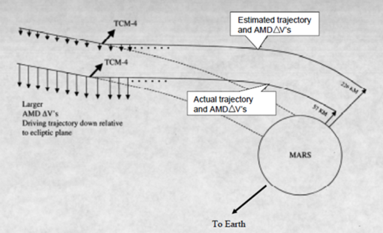
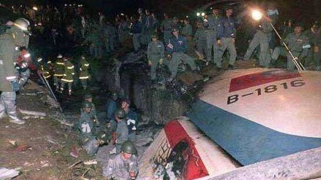
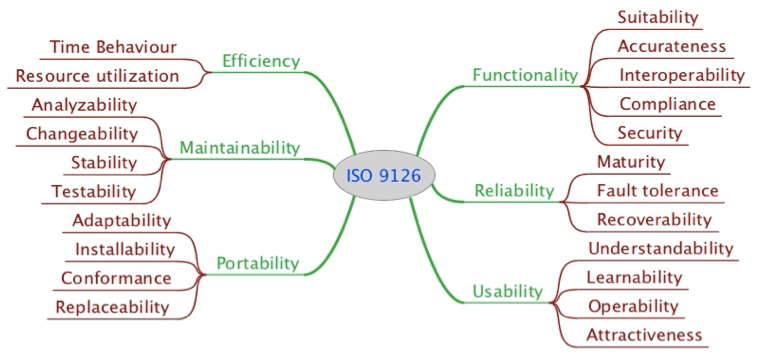
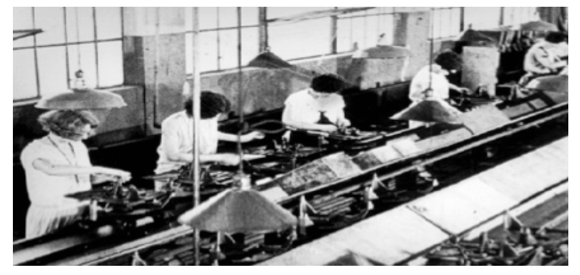

<!-- _class: toc -->

# **目錄**

* 1.1 軟體危機
* 1.2 軟體品質
* 1.3 品質模型
* 1.4 品質控制與確保
* 1.5 案例

---
# Ch01 簡介

---

## 大家都知道物質不滅定律；我們更熟悉 Bug 不滅定律！

---

## 1.1 軟體危機

水能載舟亦能覆舟，軟體也是如此。軟體問題可能導致飛機失事、醫療糾紛、財務損失。

---

### 軟體危機案例：愛國者反導彈系統

  

  因毫秒級時鐘誤差，愛國者反導彈系統失效，造成美軍重大損失。微小的程式設計缺陷，最終釀成災難。
  

  

    
  

---

### 軟體危機案例：NASA 火星氣候軌道探測器

  - 火星氣候軌道器（Mars Climate Orbiter）
  - 1998年12月
  - 目標： 進入火星軌道，研究火星氣候、大氣和地表變化。
  - 專案結果： 探測器在1999年9月抵達火星後，因進入軌道高度過低而解體，任務宣告失敗。
  - 專案代價： 損失探測器本身近2億美元，加上數年的研究心血與龐大資源投入。

  

    
  

---

### 哪裡出錯了？

  - 溝通斷裂： 不同團隊間的溝通出現致命性失誤，未能確認並統一數據單位標準。
  - 整合問題： 軟體模組在整合時，沒有進行充分的單位校驗與協調，導致系統無法正確運作。
  - 錯誤的累積： 一個看似微小的單位換算錯誤，在龐大且複雜的太空任務中被放大，最終導致災難性後果。

---

軟體危機案例：華航名古屋空難
  

    
  
  

---

### 1994年華航名古屋空難事件

* **日期：** 1994年4月26日
* **地點：** 日本名古屋機場
* **機種：** 空中巴士A300-622R
* **結果：** 飛機失速墜毀，造成264人死亡。

---

### 軟體與人機互動問題

* **飛機自動駕駛系統：** 事故主因是**自動駕駛**與**手動操控**的衝突。
    * 副駕駛在降落時，**無意間觸發「重飛」模式**。
    * 此模式下，電腦會自動將機尾水平安定面（horizontal stabilizer）設定為**機首上升**。
* **人機對抗：**
    * 駕駛員試圖手動將機首壓低以繼續降落。
    * 飛機電腦判斷駕駛員操作為錯誤，並持續執行**「重飛」指令**，與駕駛員的動作產生**激烈對抗**。
* **結果：** 由於電腦持續抬升機首，導致飛機**迎角過大**（即飛機機翼與氣流的夾角過大），最終**失去升力而失速墜毀**。

---

### 啟示

* **軟體設計缺陷：**
    * **人機介面設計不良：** 「重飛」模式的觸發方式**不夠直觀**或**缺乏足夠的警示**，使駕駛員誤觸而不自知。
    * **控制權爭奪：** 軟體設計**未考慮到駕駛員與電腦的協調性**，在緊急情況下，沒有明確的**控制優先權**機制，導致系統與人互相干擾。
* **軟體危機應對：**
    * 事後，空中巴士公司發布維修指令，**修改A300系列的電腦程式**。
    * 目的在於**防止**駕駛員與電腦在操作上產生衝突，確保人機協同，避免類似悲劇重演。

---

### 更多軟體危機案例

- 1991, 愛國者飛彈失效
- 1999, Mars Polar Lander
- 2014, 台灣新戶政系統相容問題
- 2021, 教育部學生學習歷程資料遺失
- 2014, 台灣高速公路收費系統

---
### 軟體工程目的

解決上述問題，是軟體工程與軟體品質工程的使命。

---

> 軟體和教堂非常相似——建成之後我們就開始祈禱。  
> Software and cathedrals are much the same – first we build them, then we pray.（Sam Redwine）

  

    
  
  

---

  

    
  
  

  有哪些你印象深刻的軟體品質事件？

  

---

## 1.2 軟體品質

---

> 人們會忘記你做的多快，但總記得你做的多好。

> People forget how fast you did a job- but they always remember how well you did it. (Howard Newton.)

---

### 1.2.1 軟體

- 軟體不只是程式碼，還包括流程、文件和必須的資料。
- 操作失誤常也是軟體品質問題來源。

> 程式「應給人看」，執行只是附帶任務。  
> Programs must be written for people to read, and only incidentally for machines to execute.

---

### 1.2.2 品質

Harvard教授Garvin品質五大觀點：

- 超自然觀點：質感好壞無法精確定義，但能感受。
- 使用者觀點：符合使用者需求。
- 製造觀點：符合法定流程標準。
- 產品觀點：產品本身的特性。
- 價值觀點：消費者願意購買。

---

  

    
  
  

  你周遭哪些物品品質優良？與Garvin觀點如何對應？

  

---
> 所謂的品質就是當沒有人看時，仍然把事情做對  
> Quality means doing it right when no one is looking.（Henry Ford）

> 品質不是動作，是一種習慣  
> Quality is not an act. It is a habit（Aristotle）

---

### 1.2.1 軟體品質

軟體品質有多種定義：

- 系統滿足規格需求的程度。（Crosby）
- 系統滿足顧客的需求與期望程度。（Juran）
- 達到明訂功能、效能需求及開發標準，並具隱含專業特性。（Pressman）

---

### 品質模型可幫助我們更完整理解品質內涵。

---

## 1.3 品質模型

---

各行各業有各自的品質模型
  

    
  
  

---

### 1.3.1 ISO 9126 品質模型
  

    
  
  

---
#### 1. 功能性 Functionality

- **功能正確性** Accurateness 功能的運作是否正確，例如計算帳戶的餘款是否正確。
- **規格合適性** Suitability 功能特性是否符合軟體的規格或該系統的特性。
  * Evernote 在 2015 加入了一個 chat 的功能？
- **相互運作性** Interoperability 
    - 和其他元件或系統的互動是否正確。與「可整合性」有很大的關係。
    - API (Application Interface) 
- **規範符合性** Compliance 
    - 是否符合特定業界標準與規範或法律。例如我們產生的格式是否符合 JSON格式、是否符合 SCORM 標準等。
- **安全性** Security 
    - 是否能夠阻擋非法的存取或控制。
	
---  

> 我們有時間做多餘的功能，卻沒有時間把必要的功能做對。

---
#### 2. 可靠性 Reliability
- 成熟度、容錯度、回復性

- 考慮系統是否能夠持續性維持其功能的運作
  - 一開始可以運作正常，但遇到一些外在因素（例如網路斷了，硬碟滿了）就無法回復或造成災難性的問題
  - 可靠度的檢查通常需要一段較長的時間

- 可靠度也與系統的回復能力有關係
  - 系統失效後如果能夠立即恢復正常可靠度也還可接受
  - 如果每一天做一次磁帶備份，則系統出現嚴重問題時，需要將磁帶的東西倒回系統，中間就可能喪失一天的資料，而且磁帶的回復所需要的時間會比較久。
  - 如果使用備援的架構，資料在寫入時是同時寫入兩個系統，當其中一個出現問題可以立刻切換到另一個系統，其可靠度就比較好。

---

- **成熟度** Maturity： 失效的次數越少成熟度越高。
    - 系統失效的頻率
    - 可靠度的評量通常可用 MTTF（mean time to failure） 來計算，就是平均多久失效一次。
- **容錯度** Fault tolerance 
    - 當環境或其他元件出錯時，能夠持續保持一定的運行的能力，能容忍錯誤的能力。
- **回復性** Recoverability 
    - 當環境或其他元件出錯時，能夠回復到正常運行的能力。
    - 例如有些系統要一天後才能回復，有些系統只需要停機一小時。
    - 有一些系統一個星期才備份一次，所以系統回復時可能喪失一個星期的資料，就是回復性差。

---
#### 3. 可用性 Usability
- 易了解性、易學習性、易操作性

- 「這個系統好難用！」
- ATM 自動提款機上出現的提款金額： $1000.00, $2000.00 $3000.00

---

[Gemini story](https://gemini.google.com/share/7484e9ef325c)
  

    
  
  

---
- **易了解性** Understandability  
    - 系統的功能或概念是否容易了解？是否符合使用者所認知的心理模型？
    - 電子書 3D 翻頁效果
- **易學習性** Learnability 
    - 需要花多少力氣來學習？
    - 最好的設計是不需要說明書，使用者一看就知道如何使用。
    - 只教一次就會使用。例如 iPhone 在 kill App 時需要長按該 App
- **易操作性** Operability  
    - 在指定環境下操作是否容易？

---
可用性如何檢驗？我們可以透過學習的時間數或是產能來做量化的計算。例如你設計一個需要資管人員輸入的收費單系統，如果有經驗的資管人員一小時只能打10 個停車單，表示系統的設計有問題。如果設計上有很多快速鍵，移動也很方便，一個資管人員一小時可以打上30-40 個停車單。

---

> Programming today is a race between software engineers striving to build bigger and better idiot-proof programs, and the universe trying to produce bigger and better idiots. So far, the universe is winning. (*Rick Cook*)

  

    
  
  

---
#### 4. 效能 Efficiency
- 時間效能、資源效能
  
- **時間效能** Time behavior  
  - 回應時間的長短。或是單位時間能夠處理的量。
- **資源效能** Resource behavior  
    - 消耗資源的多寡。例如  memory, cpu, disk and network usage。
    - 一般而言，時間效能越好資源校能越差，反之亦然。
    - 照片系統。

---

> 時間效能和資源效能常常會相互衝突，設計需要取捨-- 這也是為什麼品質沒有絕對，需要與使用者或設計師商討。

---
#### 5. 可維護性 Maintainability
- 可分析性、可變動性、穩定性、可測試性

大家都不理！
* 使用者通常會忽略這個因子，（因為不關他的事），也因此常常會忽略。
* 軟體公司的主管急著系統上線，也不太會關心這一點。
* 工程師雖然關心，但常因為時程壓力而忽略掉，或是覺得程式是自己寫的維護一定沒有問題，所以也常常忽略。
  * 系統過了幾年，換了幾個人維護後，可維護性就更困難了。

---

- **可分析性 Analyzability** 是否容易找出錯誤的原因。系統運行的時候如果能夠留下 log，則有助於其可分析性。
- **可變動性 Changeability**	要花多少力氣來改變系統？例如新增一個功能需要花幾個人月（man-power, man-month）。
- **穩定性 Stability** 對系統變動的敏感度，系統變動時對其他部分所造成的負面衝擊。
  - 人事的系統模組增加的了一個人員型態，居然導致財務結算的系統錯誤
- **可測試性 Testability** 當系統變動時需要花多少 effort 來做確認測試？
    - 系統的可測試性高不高？測試環境是否容易建立？虛擬模組容不容易建置？是否有相關的測試資料？
    - 自動化測試。

---
> 任何你寫的程式，超過 6 個月不去看它，當你再度開啟時，看起來都像是別人寫的。
> Any code of your own that you haven't looked at for six or more months might as well have been written by someone else. (Eagleson's law)

---

> 傻瓜都能寫出電腦能理解的程式。優秀的工程師寫出的是人類能讀懂的程式。
> Any fool can write code that a computer can understand. Good programmers write code that humans can understand. (Martin Fowler)

---
#### 6. 可移植性 Portability
- 適應性、易安裝性、相容性、易置換性

---

#### 用 ISO 9126 品質特性評析課程管理系統
以功能性、可靠性、可用性、效能、可維護性、可移植性切入，逐一檢視特性。

---

### ISO 9126 度量方法
- 內部度量：檢查程式本身（如註解率）
- 外部度量：程式執行相關（如反應時間）
- 使用品質度量：實際使用者體驗（如滿意度）

---

## 1.4 品質控制與確保

---
### 製造業品質控管方法

- 自動化
- 簡單化（分工）

---

---

#### Software Quality Assurance (SQA)

保證開發軟體符合品質規範，透過持續性的流程與活動降低風險，不可能消除所有錯誤。

---

| QC（Quality Control） | QA（Quality Assurance） |
| --------------------- | ----------------------- |
| 著重產品是否符規範    | 著重流程是否符標準      |
| 針對產物稽核          | 稽核流程、推動持續改進  |

---

### 軟體品質成本

- 預防成本（Prevention）：避免錯誤發生
- 檢驗成本（Appraisal）：上線前檢驗及修正
- 失效成本（Failure）：失效後修復、賠償

預防 & 檢驗成本遠低於失效成本。

---

## 1.5 案例：[瑞穗證券烏龍指事件](https://g.co/gemini/share/5cfc9161fe5b)
  

    
  
  

---

- 錯誤操作 + 系統 bug 導致400億日圓損失
- 究責爭議：用戶、運營商、開發商誰應擔責？
- 程式重大bug是否算過失，應有嚴謹測試、回歸驗證流程
- 法院：系統主要責任在運營商，開發商具連帶責任

---
#### 問題思考

- 上述案例，誰該負最大責任？你認為關鍵在哪？
- 身為軟體工程師，如何避免類似災難？
- 你的實務現場有什麼品質啟示？

---

[26 樓的燈光之戰](https://gemini.google.com/share/34607f1537b3)
  

    
  
  

---

  

    
  
  

  這故事有哪些隱喻？

  

---
## 練習與思考題

- 舉2~3個國內外知名軟體品質災害，說明造成影響、原因與預防可能。
- 思考：「YouBike」2016停車柱故障事件的品質根源。
- 以Garvin模型與ISO 9126分別評析你的生活品質物品/軟體。
- 品質控制與品質確保的差異？品質成本分哪三類？軟體QA與測試有何不同？

---

預防重於治療—在軟體工程也同樣適用。
Quality means doing it right when no one is looking.（Henry Ford）

---
### 參考書籍
- Jorgensen, Paul C. Software testing: a craftsman's approach.
- Patton, Ron. Software testing.
- Kaner, Cem, James Bach, Bret Pettichord. Lessons learned in software testing.

---