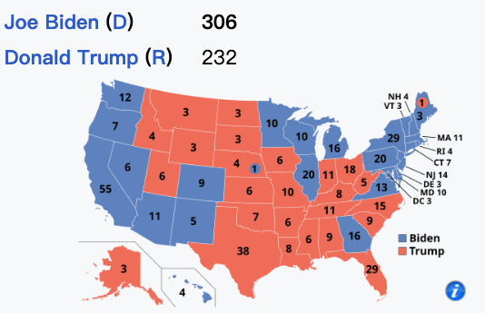

## MID-Test-113-1

### 1. 基本題 （50%）
例行賽的時候非假日票價 500 元，假日 600 元，如果是會員則打八折，但如果是買套票則一律為 250 元。季後賽票價 1000 元，會員打八折但沒有套票，也不分是否為例假日。寫一個 function 來回傳價格，並進行測試。並透過 PMD 改善你的程式碼，並產生報告。

評分：
* [ ] 能夠設計豐富而有效的測試案例（以表格規劃之）
* [ ] 完成程式可以執行，並以 JUnit 測試 
* [ ] 成功完成 PMD 程式靜態檢測的報告
* [ ] 可以依據 PMD 建議，改善程式碼

**兩題完成後請先給老師，助教初評**

**如同作業繳交一樣，請交 maven 專案檔的壓縮，需要自評與畫面貼圖**

### 2. 美國大選（50%）

美國大選的勝負是比較選舉人票數（electoral votes）的多寡，而非普選人數（popular votes），以下的資料每一行代表一個州。每一列代表一個屬性，依次為州名、選舉人票數、一號候選人得票數、二號候選人得票數（"State", "ElectoralVotes", "C1Votes", "C2Votes"）。

以下是2020 年選舉的部分資料：
```
State,EV,Biden,Trump
Alabama,9,849624,1441170
Hawaii,4,366130,196864
```
表示 Alabama 有 9 張選舉人票，Biden 拿了 849624 張普選人口票，小於 Trump 的 1441170，所以這一州 Trump 拿下了 9 張選舉人票，而拜登則為 0 票。反之，Hawaii 由 Biden 拿下 4 張。



設計一個 Java class `USAElection`, 內有 `getElectionResult(electionData)`，將會回傳一個陣列 `{Winner, Winner_electoral_votes, AlignOrSplit}`。
* Winner: 勝者的名字 (如 Biden)，如平手則為 "NONE"。
* Winner_electoral_votes: 勝者的選舉人票數 (如 306)。如平手則為 -1。
* AlignOrSplit: 選舉人票數勝負與普選人票數勝負一致則為 "Align"（符合-高票者勝選），否則為 "Split" （分裂-高票者落選）。如平手則為 "X"。

注意
* 請參考 [exam113_1/](./uxx_exam/exam113_1/USAElection.java) 的程式進行修改，該程式有少許錯誤，請善用除錯技巧進行除錯。
* 請設計測試策略並說明之
* 選舉人票總合必須為 538 票，若不符合，則拋出例外
* 測試資料請參考 votes2020.csv; 當然，你必須設計更多的測試案例與資料
* 多數州選舉人票得取得是「贏者全拿的」策略，除了 Nebraska (內布拉斯加州) 與 Maine (
5 / 5,000 緬因州) 以外-- 概略來說這兩州是依據普選票數來進行比例分配的，請依此需求修改程式，並設計測試案例。

評分
* [ ] 能修正程式，使之可以進行測試
* [ ] 測試策略說明完整，能夠因此產生豐富而有效的測試案例
* [ ] 能夠修改 Nebraska/Maine 的特殊處理，並進行測試
* [ ] 透過 JUnit 進行自動化的測試，把各種情境都確認無誤
* [ ] 改善 JUnit 的程式使之模組化，方便進行多個資料測試

**兩題完成後請先給老師，助教初評**

**如同作業繳交一樣，請交 maven 專案檔的壓縮，需要自評與畫面貼圖**

## MID-Test-112-1
112-1 期中考題

### Q1 MLB 世界大賽票價 (50%)

MLB 世界大賽的票價嚇人，起碼 2 萬元起跳。假設規則如下：(1) 一般票價 20,000 (2) 比賽當天若為六日，則價格為 25,000 (3) 如果是內野票價，比上述票價再高 5,000 元; 貴賓席則貴 15,000 元。(4) 如果透過 Ticketmaster 購買可以打九折。

- 請以等價分割的「強涵蓋」設計測試案例，以表格的方式描述測試案例。
- 撰寫程式碼並用JUnit 進行完整測試，並說明測試結果與你的完成度。


### Q2 德州遊騎兵 (50%)

2023 美國棒球大聯盟 MLB 落幕，恭喜德州遊騎兵打敗亞利桑那響尾蛇，拿到隊史成軍 63 年以來第一次的世界大賽冠軍。 `int score(inningA[], inningB[], playerA[], playerB[])` 會回傳 A 隊勝 B 隊的分數，其中：
- `inningA[]`, `inningB[]` 分別紀錄各局的得分。原則上是打滿九局，但如果九上結束後攻者已經領先前攻者，則不需進行九下，分數以 -1 或 X 標記（不可標記為 0)。若九局結束仍然平分，則繼續進行第十局直到勝負。請檢查這兩個資料是否符合常規，若否則拋出例外。
- `playerA[]`, `playerB[]` 分別紀錄兩隊隊員的得分，A 隊隊員得分之總和應與 `inningA[]` 之個局之總和相同，依此類推。若不符合常規則拋出例外。
- 若資料檢查無誤，則回傳 A 隊勝 B 隊的分數。若為負數表示 A 隊輸，反之則 A 隊贏。不可能為零。
- 撰寫程式碼並用 JUnit 進行完整測試，並說明測試結果與你的完成度。

Hint

- 九局正常結束（沒有提前）
    - inningA, inningB, playerA, playerB
    - [1,1,1,1,1,1,1,1][1,1,1,1,1,1,1,2] [2,0,1,1,1,1,0,2] [1,1,3,0,0,1,1,2] => -1 B win
    - [1,1,1,1,1,1,1,2][1,1,1,1,1,1,1,1] [1,1,3,0,0,1,1,2] [2,0,1,1,1,1,0,2] => 1 A win

- 至少九局，小於九局就拋出例外
    - inningA[] = [1,2,3]; inningB[] = [3,4,5] ⇒ Exception(“局數小於九局”)

- 九局有提前結束 (分數為 X)
    - 如果第 9 局有 X 分數者，則該隊前 8 局的分數和大於另一對的 9 局分數和; 且 X 分者，必定為後攻球隊
    - [1,1,1,1,1,1,1,1,1]  [1,1,1,1,1,1,1,3,X]⇒ -1 (差分 1; B win)
    - [1,1,1,1,1,1,1,1,1]  [1,1,1,1,1,1,1,1,X]⇒ Exception(“不合理的提前結束”)

- 延長
    - 合理正常的延長
        - [1,1,1,1,1,1,1,1,2][1,1,1,1,1,1,1,1,3] ⇒ -1 B win, 延長到 10局
        - [1,1,1,1,1,1,1,1,3][1,1,1,1,1,1,1,1,2] ⇒  1 A win, 延長到 10局
    - 無必要的延長
        - [1,1,1,1,1,1,1,2,2][1,1,1,1,1,1,1,1,3] => Exception(“沒有必要的延長局”); 九局時 A win
        - 延長局必定上下局都會打
[1,1,1,1,1,1,1,1,1,2] [1,1,1,1,1,1,1,1,1,X]⇒ Exception(“提前結束只可能出現在九下”)

- 所有全員的總得分 = 該隊為各局的總得分 
    - [1,1,1,1,1,1,1,2][1,1,1,1,1,1,1,1] => 
[1,1,3,0,0,1,1,2] [2,0,1,1,1,1,0,2] 
⇒ A隊的總分為 10, 但Ａ隊全員的總得分只有 9 => Exception(“總分不一致”)

- 必須分出勝負 （差分 !=0)
    - [1,1,1,1,1,1,1,1][1,1,1,1,1,1,1,1] => Exception(不可以和局)