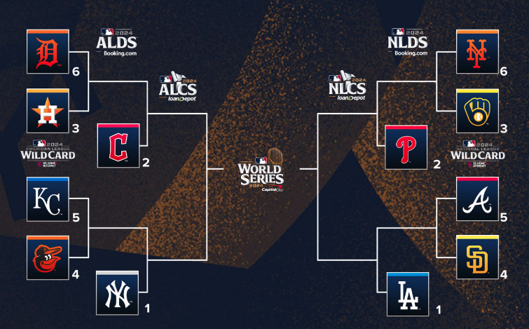

| [H01](#h01-季後賽)| [H02](#h02-分潤) | [H03](#h03-封殺) | [H04](#h04-投手的選擇)

## H01 季後賽
美國職棒大聯盟洛杉磯道奇隊球星大谷翔平日前完成 50-50 的創舉，並成功取得季後賽的門票，恭喜大谷。

寫一個程式來依據各隊的戰績排程季後賽的對戰圖表。

> 儘量採取 preventive programming 的策略來進行開發。

> 設計一個資料格式來儲存各隊的例行賽成績。

輸出格式如下：
```
(AMERICAN LEAGE)
|WILDCARD | ALDS  | ALCS    | WORLD SERIES |
DET 6 ---
HOU 3 --- ? -----
      CLE 2 ----- ? -------
KC  5 ---
BAL 4 --- ? -----  
      NYY 1 ----- ? ------- ? -------
                                       ? 
NYM 6 --- ? ----- ? ------- ? ------- 
MIL 3 --- 
      PHI 2 ---- 
ALT 5 --- ? ----- ? -------
SD  4 ---  
      LAD 1 ----- 
|WILDCARD | NLDS  | NLCS    | WORLD SERIES |
(NATIONAL LEAGE)
```

以下是一個假想示意圖幫助你了解上面輸出的含義

```
(AMERICAN LEAGE)
|WILDCARD  | ALDS    | ALCS     | WORLD SERIES |
DET 6 >>>
HOU 3 --- DET -----
        CLE 2 >>>>> CLE -------
KC  5 ---
BAL 4 >>> BAL -----  
        NYY 1 >>>>> NYY >>>>>>> NYY -------
                                              LAD
NYM 6 --- MIL ----- PHI ------- LAD >>>>>>> 
MIL 3 >>> 
        PHI 2 >>>>> 
ALT 5 ---  SD ----- LAD >>>>>>>
SD  4 >>>  
        LAD 1 >>>>>
|WILDCARD | NLDS    | NLCS    | WORLD SERIES |
(NATIONAL LEAGE)
```


規則說明如下：

美國職棒大聯盟（MLB）的季後賽對戰排程是依據每年例行賽的戰績來決定的。季後賽包含以下幾個階段，每一階段的對戰規則都有固定的安排：

### 1. **外卡系列賽（Wild Card Series）**
- 自 2022 年起，外卡系列賽有兩個聯盟（美聯和國聯），各有三場比賽，由三支外卡球隊與一支分區冠軍球隊參與。
- **六支球隊晉級季後賽**：
  - 每個聯盟有 **三個分區冠軍** 和 **三支外卡球隊**（外卡球隊是各聯盟戰績最佳的非分區冠軍球隊）。
- **對戰安排**：
  - 戰績最好的分區冠軍（第 1 種子）和第二好的分區冠軍（第 2 種子）在這一輪輪空，直接晉級下一輪。
  - 第 3 種子的分區冠軍對戰戰績最差的外卡球隊（第 6 種子），而戰績最好的外卡球隊（第 4 種子）對戰第二好的外卡球隊（第 5 種子）。
  - 系列賽為三戰兩勝制，前三場比賽均在戰績較好的球隊主場進行。

**ps.** 若戰積相同，聯盟依據對戰紀錄來決定排名，為簡化，此題採取簡單策略，依據隊名代碼的排序來決定排名。例如 LAA, MIL, PHI 若分別為國家聯盟西區、中區、東區的冠軍，且戰績都是 96W-66L, 則因 'LAA' < 'MIL' < 'PHI', 所以分別為第 1, 2, 3 種子。

### 2. **分區系列賽（Division Series，DS）**
- 在外卡系列賽勝出的兩支球隊，進入聯盟的分區系列賽。
- **對戰安排**：
  - 戰績最佳的分區冠軍（第 1 種子）對戰戰績最差的勝出球隊。
  - 另一場則是第 2 種子分區冠軍對戰另一支勝出球隊。
  - 系列賽為五戰三勝制，採用 **2-2-1** 的主場模式，戰績較好的球隊先有兩場主場比賽，第五場如果有需要則在戰績較好的球隊主場進行。

### 3. **聯盟冠軍系列賽（League Championship Series，LCS）**
- 分區系列賽的勝者進入聯盟冠軍系列賽。
- **對戰安排**：
  - 這是七戰四勝制的系列賽，採用 **2-3-2** 的主場模式。
  - 戰績較好的球隊先在主場進行兩場比賽，接下來三場在對手主場（若需要），最後兩場回到戰績較好的球隊主場（若需要）。
  - 美聯和國聯各自決出冠軍，進入世界大賽。

### 4. **世界大賽（World Series）**
- 這是 MLB 季後賽的最終對決，由美聯冠軍和國聯冠軍進行七戰四勝制的比賽，決出最終的世界冠軍。
- **對戰安排**：
  - 仍採用 **2-3-2** 的主場模式。根據自 2017 年起的規則，主場優勢由兩個聯盟中例行賽戰績較好的球隊獲得。

### 其他要點：
- **主場優勢**：戰績較好的球隊通常享有主場優勢，這意味著他們在系列賽中能有更多的主場比賽。
- **種子排名**：例行賽結束後，每個聯盟的球隊會根據戰績進行種子排名，決定季後賽對戰安排。每個球隊每個球季共比賽 162 場，沒有平手，一定打到出勝負。

MLB 季後賽從外卡系列賽開始，經過分區系列賽、聯盟冠軍系列賽，最後進入世界大賽，每一階段的比賽對戰和主場安排都依賴於例行賽的戰績排名和種子位置。


#### 美國聯盟 (AL)
* 東區
    * **巴爾的摩金鶯 (Baltimore Orioles; BAL)** - 巴爾的摩，馬里蘭州
    * **波士頓紅襪 (Boston Red Sox; BOS)** - 波士頓，麻薩諸塞州
    * **紐約洋基 (New York Yankees; NYY)** - 紐約，紐約州
    * **坦帕灣光芒 (Tampa Bay Rays; TB)** - 聖彼得堡，佛羅里達州
    * **多倫多藍鳥 (Toronto Blue Jays; TOR)** - 多倫多，加拿大安大略省
* 中區
    * **芝加哥白襪 (Chicago White Sox; CWS)** - 芝加哥，伊利諾州
    * **克里夫蘭守護者 (Cleveland Guardians; CLE)** - 克里夫蘭，俄亥俄州
    * **底特律老虎 (Detroit Tigers; DET)** - 底特律，密西根州
    * **堪薩斯市皇家 (Kansas City Royals; KC)** - 堪薩斯市，密蘇里州
    * **明尼蘇達雙城 (Minnesota Twins; MIN)** - 明尼阿波利斯-聖保羅，明尼蘇達州
* 西區    
    * **洛杉磯天使 (Los Angeles Angels; LAA)** - 阿納海姆，加利福尼亞州
    * **奧克蘭運動家 (Oakland Athletics; OAK)** - 奧克蘭，加利福尼亞州
    * **西雅圖水手 (Seattle Mariners; SEA)** - 西雅圖，華盛頓州
    * **德州遊騎兵 (Texas Rangers; TEX)** - 阿靈頓，德州
    * **休士頓太空人 (Houston Astros; HOU)** - 休士頓，德州

#### 國家聯盟 (NL)
* 東區
    * **亞特蘭大勇士 (Atlanta Braves; ATL)** - 亞特蘭大，喬治亞州
    * **華盛頓國民 (Washington Nationals; WSH)** - 華盛頓特區
    * **邁阿密馬林魚 (Miami Marlins; MIA)** - 邁阿密，佛羅里達州
    * **費城費城人 (Philadelphia Phillies; PHI)** - 費城，賓夕法尼亞州
    * **紐約大都會 (New York Mets; NYM)** - 紐約，紐約州
* 中區
    * **芝加哥小熊 (Chicago Cubs; CHC)** - 芝加哥，伊利諾州
    * **匹茲堡海盜 (Pittsburgh Pirates; PIT)** - 匹茲堡，賓夕法尼亞州
    * **辛辛那提紅人 (Cincinnati Reds; CIN)** - 辛辛那提，俄亥俄州
    * **密爾瓦基釀酒人 (Milwaukee Brewers; MIL)** - 密爾瓦基，威斯康辛州
    * **聖路易紅雀 (St. Louis Cardinals; STC)** - 聖路易，密蘇里州
* 西區
    * **科羅拉多洛磯 (Colorado Rockies; COL)** - 丹佛，科羅拉多州
    * **亞利桑那響尾蛇 (Arizona Diamondbacks; AZ)** - 鳳凰城，亞利桑那州
    * **洛杉磯道奇 (Los Angeles Dodgers; LAD)** - 洛杉磯，加利福尼亞州
    * **聖地牙哥教士 (San Diego Padres; SD)** - 聖地牙哥，加利福尼亞州
    * **舊金山巨人 (San Francisco Giants; SF)** - 舊金山，加利福尼亞州

ps. 可以以 [2023 的資料](https://www.mlb.com/standings/2023?tableType=regularSeasonStandard)做為測試。

---


## H02 分潤



季後賽的票價通常比較貴，假設為 450 美金，到了世界大賽則可以到 800 美金。票價收入 85% 都歸主場球隊，其餘 15% 則歸客隊。每個球場的座位數都不同：

以下是球隊的球場名稱、座位數、季後賽滿座率和世界大賽滿座率的表格：

| 球隊               | 球場名稱              | 座位數 | 季後賽滿座率 | 世界大賽滿座率 |
| ------------------ | --------------------- | ------ | ------------ | -------------- |
| 洛杉磯道奇 LAD     | Dodger Stadium        | 56k    | 100%         | 100%           |
| 聖地牙哥教士 SD    | Petco Park            | 40k    | 100%         | 100%           |
| 密爾瓦基釀酒人 MIL | American Family Field | 42k    | 97%          | 100%           |
| 紐約大都會 NYM     | Citi Field            | 41.8k  | 100%         | 100%           |
| 亞特蘭大勇士 ATL   | Truist Park           | 41k    | 100%         | 100%           |
| 巴爾的摩金鶯 BAL   | Oriole Park           | 45k    | 100%         | 100%           |
| 紐約洋基 NYY       | Yankee Stadium        | 47k    | 100%         | 100%           |
| 克里夫蘭守護者 CLE | Progressive Field     | 34.8k  | 98%          | 100%           |
| 休士頓太空人 HOU   | Minute Maid Park      | 41k    | 100%         | 100%           |
| 堪薩斯市皇家 KS    | Kauffman Stadium      | 37k    | 100%         | 100%           |
| 底特律老虎 DET     | Comerica Park         | 41k    | 100%         | 100%           |
| 費城費城人隊 PHI   | Citizens Bank Park    | 42,7k  | 100%         | 100%           |

從美國職棒大聯盟（MLB）的外卡賽開始到世界大賽，每個階段的比賽場次及主客場安排規則如下：

### 1. **外卡系列賽（Wild Card Series）**
   - **比賽場次**：3戰2勝制（最多3場比賽）
   - **主客場安排**：所有比賽都在種子排名較高的球隊主場進行。這意味著三場比賽全都在同一支球隊的主場，不進行客場比賽。
   - **參賽球隊**：兩支外卡球隊和各聯盟中排名較低的分區冠軍進行比賽。

### 2. **分區系列賽（Division Series, LDS）**
   - **比賽場次**：5戰3勝制（最多5場比賽）
   - **主客場安排**：
     - 第1場、第2場、第5場（若需要）在排名較高的球隊主場進行。
     - 第3場、第4場（若需要）在排名較低的球隊主場進行。
   - **主場安排順序**：**2-2-1**，即前兩場在較高種子球隊主場，接下來的兩場在較低種子球隊主場，第五場再回到較高種子球隊主場。
   - **參賽球隊**：外卡系列賽的勝者與分區冠軍球隊。

### 3. **聯盟冠軍賽（Championship Series, LCS）**
   - **比賽場次**：7戰4勝制（最多7場比賽）
   - **主客場安排**：
     - 第1場、第2場、第6場（若需要）、第7場（若需要）在較高種子球隊主場進行。
     - 第3場、第4場、第5場（若需要）在較低種子球隊主場進行。
   - **主場安排順序**：**2-3-2**，即前兩場在較高種子球隊主場，接下來的三場在較低種子球隊主場，最後兩場回到較高種子球隊主場。
   - **參賽球隊**：分區系列賽的勝者，爭奪進入世界大賽的資格。

### 4. **世界大賽（World Series）**
   - **比賽場次**：7戰4勝制（最多7場比賽）
   - **主客場安排**：
     - 第1場、第2場、第6場（若需要）、第7場（若需要）在較高種子球隊主場進行（根據常規賽戰績決定）。
     - 第3場、第4場、第5場（若需要）在較低種子球隊主場進行。
   - **主場安排順序**：**2-3-2**，和聯盟冠軍賽相同。
   - **參賽球隊**：美聯冠軍與國聯冠軍爭奪世界大賽冠軍。

### 總結：
- **外卡系列賽**：3戰2勝制，全在較高種子球隊主場。
- **分區系列賽**：5戰3勝制，主場安排為**2-2-1**。
- **聯盟冠軍賽與世界大賽**：7戰4勝制，主場安排為**2-3-2**。

這些比賽安排有助於讓戰績更好的球隊在系列賽中獲得更多的主場優勢，但也保留了客場挑戰的平衡性。

依據上述規則，計算每個球隊在整個季後賽的獲利預估，最高及最低的收益。例如如果紐約大都會（NYM）在外卡系列前兩戰就輸了 密爾瓦基釀酒人隊(MIL)，其獲利為：
* 42000 * 0.97 * 450 * 0.15 * 2 = 5,499,900 （約台幣 17 億）
* (座位數) * (滿座率) * (票價) * (客場分潤) * (場數)

作業
* 但如果一路打到世界大賽第七戰，則其收益為最佳。請呈現 12 隊的最佳與最差收益，並列出其相對的情境。
* 輸入為 12 隊的隊名及其排名 (1-6), 球場的座位數及預估的滿座率
* 須說明最佳收益與最差收益的情境，及其運算的方法
* 開發過程請善用 preventive programming
* 以 PMD 進行 code review
* 在編寫程式時，應避免硬編碼參數（hard-coding）。應將變數、設定或參數抽離，以提高程式的靈活性和可維護性，並便於後期修改和擴展。例如：請參考 H01 作法，設計一資料結構，儲存各參數與設定。

繳交
* 把 POM 原始檔連同報告壓成 ZIP 檔繳交
* 原始檔必須包含改善前與改善後，分開放置於不同目錄（如老師講義的 xdemo, demo）
* 報告須包含 PMD 所產生的報告，以及自己的設計
* 報告請用 PDF, 不要用 word; 使用 ZIP 勿用 RAR
* 專案請用 HW02-學號

## H03 封殺

### H03A
2024/9/25, 道奇對上教士，九局下半道奇 2:4 落後，無人出局分佔一二壘，擔任打擊的 Rojas 打擊狀況並不是很好，照理說會用短打推進，再把機會留給一棒狀況不錯的大谷翔平。但 Rojas 打出三壘方向的強襲滾地球，三壘手踩壘包後快傳二壘，二壘手再快傳一壘，完成了少見的「三殺打」!。當一二壘有人時，一二三壘同為可封殺的狀態（force out），相較於刺殺（tag out），封殺只要踩壘包就好，所以較容易形成雙殺打或甚至於三殺打。


題目：輸入目前壘上的狀態，輸出滾地球可封殺的壘包。例如
```
x       -> 1B
1B      -> 1B, 2B
1B, 3B  -> 1B, 2B
3B      -> 1B
```
回傳的資料順序並不重要，例如 1B 回傳 2B, 1B 也是對的。

ps. 1B, 2B, 3B, HB 分別代表1-3壘及本壘

請使用 JUnit 設計測試案例並執行之。並採用 Jacoco 產生白箱測試報告。

### H03B
請針對 [H01](#h01-季後賽) 設計測試案例，並測試之。分享與第一次沒有用 JUnit 的差異，包含檢驗第一次寫的程式是對的嗎？注意：為了提高可測試度，適當的改寫程式結構是必要的。

## H04 投手的選擇
每個打擊者都有他擅長打的位置，以打擊為視角我們可以畫出一個 zone chart, 中心的九宮格是好球(左上到右下 1-9 號位置) ，外側的四方格則為壞球(左上到右下 x1-x4位置)。Pitch Breakdown 表示過去一段時間投手投的位置，Base Hits Breakdown 則為安打的位置。依此，我們可以算出每個打擊者針對每個位置的打擊率。對於投手而言，我們希望投出的是「看起來會是打擊率高的點，但最後轉到打擊率低點的點」。


另外，如果已經三個壞球了，投手就不會冒險投出轉到壞球的區域; 反之，還沒有球數的時候投手有投出壞球引誘打者出棒的空間。我們寫一個程式 `pitch(batter, ballIsOK)`- 依據打擊者在各區域的 `pitch_breakdown`, `base_hits_breakdown`, 以及是否可投壞球來做投球建議。例如打者五號位置打擊率最好，一號位置最差，投手不想投壞球，則回傳為 ('5', '1') 表示是五號轉一號的滑球或卡特球。

```
pitch(batter, false) -> ('5', '1')
```

其中 `batter` 為一物件，封裝 `pitch_breakdown` 及 `base_hits_breakdown`。`ballIsOK` 表示是否可投壞球，`True` 表示可以。

如果投出壞球也沒關係，且打者 x1 的位置打擊率比 1 號位置更差，則回傳 ('5', 'x1')：

```
pitch(batter, true) -> ('5', 'x1')
```

但如果 1 號位置的打擊率更差則還是回傳 ('5', '1')

注意，可能有兩個區域的打擊率是一樣的，如此，回傳的建議則兩者皆可。

完成此程式、使用 JUnit 撰寫測試案例、並產生測試涵蓋度。

自我檢查表
* [ ] 完成 `pitch()` 的程式設計
* [ ] 透過 JUnit 進行測試
* [ ] 使用 DisplayName 來解說測試
* [ ] 應用 ParameterizeTest 來簡化測試案例的設計
* [ ] 使用 Coverage 來檢查還涵蓋度，並添加測試以提升涵蓋度
* [ ] 產生測試報告
* [ ] 透過 Jacoco 產生測試報告

> 棒球英文：`ball`- 壞球; `strike`- 好球

ps. 投手可以透過不同的投球方式控制球的軌跡。


## FP 期末專題


1. 需有一定複雜度的功能運算，
2. 需規劃測試設計
3. 需採用 Junit 進行自動化測試
4. 需產生 PMD code review report; Jacoco 測試報告

