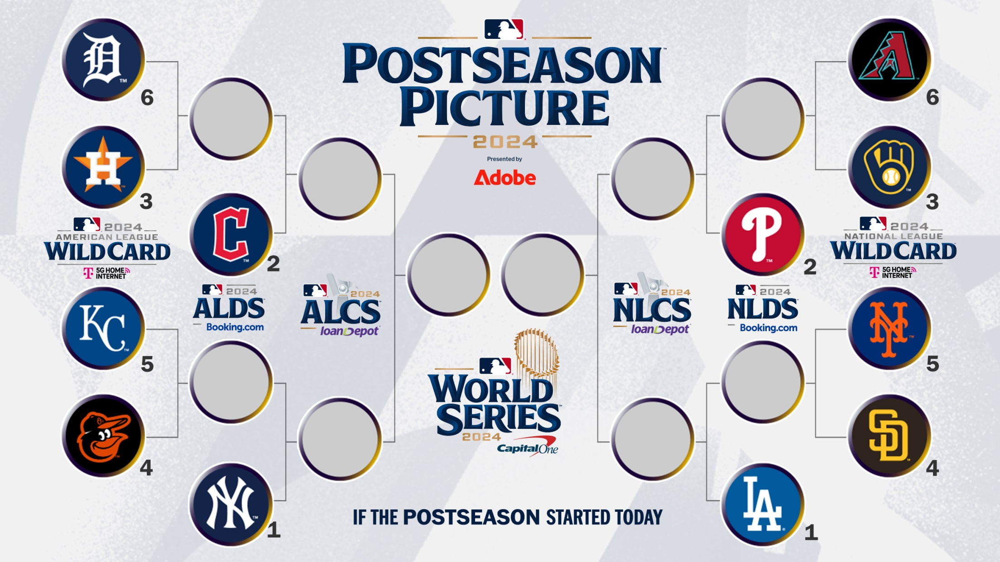
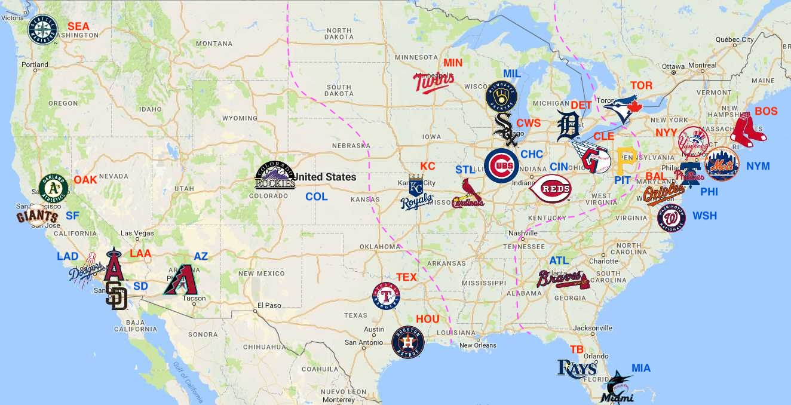

## H01 季後賽
美國職棒大聯盟洛杉磯道奇隊球星大谷翔平日前完成 50-50 的創舉，並成功取得季後賽的門票，恭喜大谷。

寫一個程式來依據各隊的戰績排程季後賽的對戰圖表。

> 儘量採取 preventive programming 的策略來進行開發。

> 設計一個資料格式來儲存各隊的例行賽成績。

輸出格式如下：
```
(AMERICAN LEAGE)
KC  6 -----
HOU 3 ----- ? -----
        CLE 2 ----- ? 
DET 5 -----
BAL 4 ----- ? -----  
        NYY 1 ----- ? ----- ?
                               ---- ?
AZ  6 ----- ? ----- ? ----- ? 
MIL 3 ----- 
        PHI 2 ---- 
NYM 5 ----- ? ----- ? 
SD  4 -----  
        LAA 1 ----- 
(NATIONAL LEAGE)
```



規則說明如下：

美國職棒大聯盟（MLB）的季後賽對戰排程是依據每年例行賽的戰績來決定的。季後賽包含以下幾個階段，每一階段的對戰規則都有固定的安排：

### 1. **外卡系列賽（Wild Card Series）**
- 自 2022 年起，外卡系列賽有兩個聯盟（美聯和國聯），各有三場比賽，由三支外卡球隊與一支分區冠軍球隊參與。
- **六支球隊晉級季後賽**：
  - 每個聯盟有 **三個分區冠軍** 和 **三支外卡球隊**（外卡球隊是各聯盟戰績最佳的非分區冠軍球隊）。
- **對戰安排**：
  - 戰績最好的分區冠軍（第 1 種子）和第二好的分區冠軍（第 2 種子）在這一輪輪空，直接晉級下一輪。
  - 第 3 種子的分區冠軍對戰戰績最差的外卡球隊（第 6 種子），而戰績最好的外卡球隊（第 4 種子）對戰第二好的外卡球隊（第 5 種子）。
  - 系列賽為三戰兩勝制，前三場比賽均在戰績較好的球隊主場進行。

**ps.** 若戰積相同，聯盟依據對戰紀錄來決定排名，為簡化，此題採取簡單策略，依據隊名代碼的排序來決定排名。例如 LAA, MIL, PHI 若分別為國家聯盟西區、中區、東區的冠軍，且戰績都是 96W-66L, 則因 'LAA' < 'MIL' < 'PHI', 所以分別為第 1, 2, 3 種子。

### 2. **分區系列賽（Division Series，DS）**
- 在外卡系列賽勝出的兩支球隊，進入聯盟的分區系列賽。
- **對戰安排**：
  - 戰績最佳的分區冠軍（第 1 種子）對戰戰績最差的勝出球隊。
  - 另一場則是第 2 種子分區冠軍對戰另一支勝出球隊。
  - 系列賽為五戰三勝制，採用 **2-2-1** 的主場模式，戰績較好的球隊先有兩場主場比賽，第五場如果有需要則在戰績較好的球隊主場進行。

### 3. **聯盟冠軍系列賽（League Championship Series，LCS）**
- 分區系列賽的勝者進入聯盟冠軍系列賽。
- **對戰安排**：
  - 這是七戰四勝制的系列賽，採用 **2-3-2** 的主場模式。
  - 戰績較好的球隊先在主場進行兩場比賽，接下來三場在對手主場（若需要），最後兩場回到戰績較好的球隊主場（若需要）。
  - 美聯和國聯各自決出冠軍，進入世界大賽。

### 4. **世界大賽（World Series）**
- 這是 MLB 季後賽的最終對決，由美聯冠軍和國聯冠軍進行七戰四勝制的比賽，決出最終的世界冠軍。
- **對戰安排**：
  - 仍採用 **2-3-2** 的主場模式。根據自 2017 年起的規則，主場優勢由兩個聯盟中例行賽戰績較好的球隊獲得。

### 其他要點：
- **主場優勢**：戰績較好的球隊通常享有主場優勢，這意味著他們在系列賽中能有更多的主場比賽。
- **種子排名**：例行賽結束後，每個聯盟的球隊會根據戰績進行種子排名，決定季後賽對戰安排。每個球隊每個球季共比賽 162 場，沒有平手，一定打到出勝負。

MLB 季後賽從外卡系列賽開始，經過分區系列賽、聯盟冠軍系列賽，最後進入世界大賽，每一階段的比賽對戰和主場安排都依賴於例行賽的戰績排名和種子位置。

### 美國聯盟 (AL)
* 東區
    * **巴爾的摩金鶯 (Baltimore Orioles; BAL)** - 巴爾的摩，馬里蘭州
    * **波士頓紅襪 (Boston Red Sox; BOS)** - 波士頓，麻薩諸塞州
    * **紐約洋基 (New York Yankees; NYY)** - 紐約，紐約州
    * **坦帕灣光芒 (Tampa Bay Rays; TB)** - 聖彼得堡，佛羅里達州
    * **多倫多藍鳥 (Toronto Blue Jays; TOR)** - 多倫多，加拿大安大略省
* 中區
    * **芝加哥白襪 (Chicago White Sox; CWS)** - 芝加哥，伊利諾州
    * **克里夫蘭守護者 (Cleveland Guardians; CLE)** - 克里夫蘭，俄亥俄州
    * **底特律老虎 (Detroit Tigers; DET)** - 底特律，密西根州
    * **堪薩斯市皇家 (Kansas City Royals; KC)** - 堪薩斯市，密蘇里州
    * **明尼蘇達雙城 (Minnesota Twins; MIN)** - 明尼阿波利斯-聖保羅，明尼蘇達州
* 西區    
    * **洛杉磯天使 (Los Angeles Angels; LAA)** - 阿納海姆，加利福尼亞州
    * **奧克蘭運動家 (Oakland Athletics; OAK)** - 奧克蘭，加利福尼亞州
    * **西雅圖水手 (Seattle Mariners; SEA)** - 西雅圖，華盛頓州
    * **德州遊騎兵 (Texas Rangers; TEX)** - 阿靈頓，德州
    * **休士頓太空人 (Houston Astros; HOU)** - 休士頓，德州

### 國家聯盟 (NL)
* 東區
    * **亞特蘭大勇士 (Atlanta Braves; ATL)** - 亞特蘭大，喬治亞州
    * **華盛頓國民 (Washington Nationals; WSH)** - 華盛頓特區
    * **邁阿密馬林魚 (Miami Marlins; MIA)** - 邁阿密，佛羅里達州
    * **費城費城人 (Philadelphia Phillies; PHI)** - 費城，賓夕法尼亞州
    * **紐約大都會 (New York Mets; NYM)** - 紐約，紐約州
* 中區
    * **芝加哥小熊 (Chicago Cubs; CHC)** - 芝加哥，伊利諾州
    * **匹茲堡海盜 (Pittsburgh Pirates; PIT)** - 匹茲堡，賓夕法尼亞州
    * **辛辛那提紅人 (Cincinnati Reds; CIN)** - 辛辛那提，俄亥俄州
    * **密爾瓦基釀酒人 (Milwaukee Brewers; MIL)** - 密爾瓦基，威斯康辛州
    * **聖路易紅雀 (St. Louis Cardinals; STC)** - 聖路易，密蘇里州
* 西區
    * **科羅拉多洛磯 (Colorado Rockies; COL)** - 丹佛，科羅拉多州
    * **亞利桑那響尾蛇 (Arizona Diamondbacks; AZ)** - 鳳凰城，亞利桑那州
    * **洛杉磯道奇 (Los Angeles Dodgers; LAD)** - 洛杉磯，加利福尼亞州
    * **聖地牙哥教士 (San Diego Padres; SD)** - 聖地牙哥，加利福尼亞州
    * **舊金山巨人 (San Francisco Giants; SF)** - 舊金山，加利福尼亞州

ps. 可以以 [2023 的資料](https://www.mlb.com/standings/2023?tableType=regularSeasonStandard)做為測試。

---



