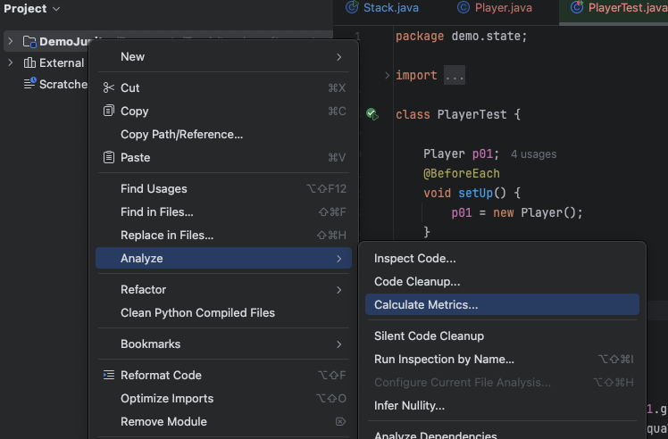
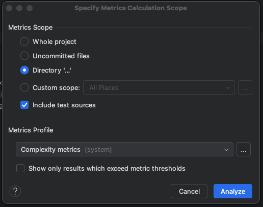

Install Cyclomatic Complexity metric to your Intellij
* Intellij >> Settings >> Plugins >> Marketplace >> search "MetricsReloaded"
  * Install
  * Restart
  * Choolse a file, package or whole project
    * On the project, right click the mouse, choose "Analyze" >> "Calculate metrics"
    * Select the "Complexity metrics"
    * Click "Analyze"
  * On the bottom panel, you will see the metrics

## Metrics

### v(G) (Cyclomatic Complexity) 方法複雜度

- **Definition**: Cyclomatic complexity (\( v(G) \)) is a measure of the **number of linearly independent paths** through a program’s source code. It is calculated for each method and gives an indication of its structural complexity.

- **Purpose**:
  - Indicates how complex a method is in terms of its control flow.
  - Helps identify methods that are prone to bugs or difficult to test.

- **Typical Values**:
  - \( v(G) = 1 \): Straight-line code, no branches.
  - \( v(G) > 10 \): Code is complex and may require refactoring.

### WMC (Weighted Methods per Class) 類別方法複雜度總和

- **Definition**: **WMC** is the sum of the cyclomatic complexities of all methods in a class.
- **Purpose**: Measures the total complexity of a class by aggregating the complexity of its methods. It reflects the overall effort required to understand or modify the class.

- **Implication**:
  - A high WMC indicates a potentially bloated or overly complex class.
  - Classes with high WMC values may benefit from refactoring to reduce complexity.

---
### OCavg 類別平均方法複雜度

OCavg (Average Cyclomatic Complexity of Operations)

- **Definition**: OCavg stands for the **average cyclomatic complexity of all methods** (or operations) within a class.
- **Purpose**: This metric gives an indication of how complex the methods in a class are, on average.

- **Implication**:
  - Higher values suggest a class contains methods that are overly complex, which may be harder to maintain or test.

--- 

### CogC (Cognitive Complexity) 認知複雜度

**Cognitive Complexity** (\( CogC \)) is a newer metric designed to measure how **difficult code is to understand**. Unlike cyclomatic complexity, which focuses on control flow, cognitive complexity emphasizes **human comprehension** and assigns weights to different types of code structures based on how mentally taxing they are.

Key Principles
1. **Structural Complexity**:
   - Adds complexity for each nested structure (e.g., `if`, `for`, `while`).
   - Penalizes deeply nested constructs more heavily.

2. **Incremental Cost**:
   - Adds incremental complexity for certain constructs like `switch-case`, `try-catch`, etc.

3. **Readability Matters**:
   - Avoids penalizing straightforward, linear code.
   - Encourages refactoring of deeply nested or hard-to-follow logic.

### LOC (line of code)

* CLOC: Comment LOC 註解的行數
* JLOC: Java Comment LOC Java 註解的行數
  * CLOC 包含 JLOC
* NCLOC: Non-Comment LOC 不含註解的行數
* RLOC: Real LOC 不含註解予宣告，真正可以執行的行數

In the package view
* LOC(rec): LOC recursive 包含所有子 package 的行數
* LOCp: LOC per class 該 package 下平均每個 class 的行數