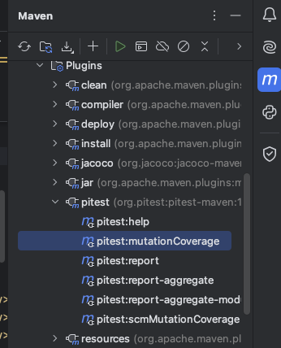

## Mutation test

### Poject DemoMutation

#### Triangle 

考慮 [Triangle](../../Intellij/DemoMutation/src/main/java/demo/Triangle.java) Example, 在 demo.mutant 下我們建立許多 mutants; TriangleMuTest 中我們設計測試案例以 kill 這些變異。
* 觀察 mutant 被刪除的狀況
* 產生更多的 mutant, 觀察是否可被現有的測試案例刪除
* 產生更多的測試案例，刪除全部的變異，如果無法刪除，請說明為什麼

#### BinarySearch

考慮 [Binary](../../Intellij/DemoMutation/src/main/java/demo/Binary.java) Example, 在 demo.mutant 下我們建立許多 mutants; BinarySearchMuTest 中我們設計測試案例以 kill 這些變異。
* 觀察 mutant 被刪除的狀況-- how to kill bs02?
* When we add the bs03 mutant, what happen?
* Is the mutant easy to build?

### Project Mutation4

Using PIT plugins for mutation test

開啟 `Mutation4` 專案，注意 POM 檔，這個專案是用 Junit4 (JUnit 5 無支援)。
* 執行 maven test 後，從 maven 視窗執行 Plugins/pitest/pitest:mutationCoverage
* 從 maven 視窗執行 Plugins/pitest/pitest:report
* 觀察 mutation score; 增加 Triangle 的測試案例，再觀察 mutation score
* 同樣的測試案例，branch coverage 和 mutation score 的比較
* Reference: [pitest doc](https://pitest.org/quickstart/mutators/)

### Binary Search

Using PIT plugins for mutation test
* 執行 maven test 後，從 maven 視窗執行 Plugins/pitest/pitest:mutationCoverage
* 觀察 mutation score; 增加 Triangle 的測試案例，再觀察 mutation score
* 同樣的測試案例，branch coverage 和 mutation score 的比較