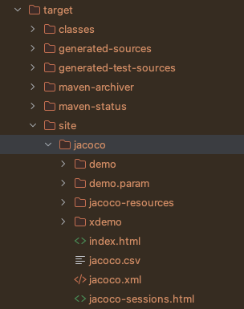
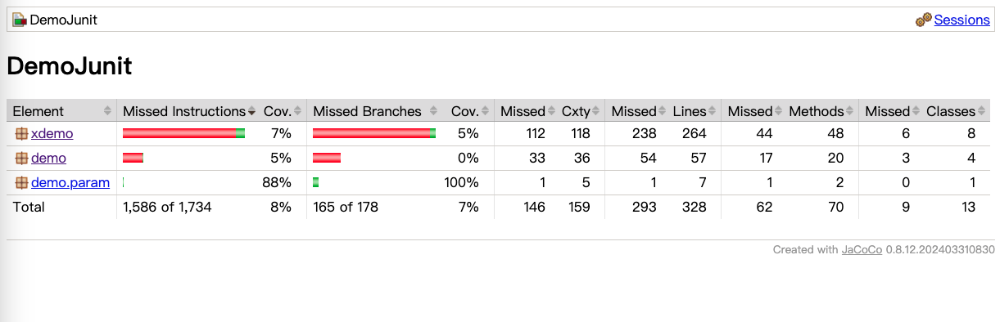
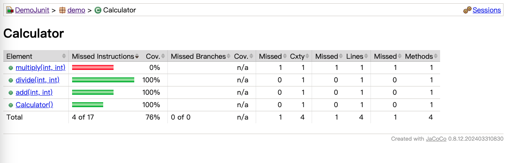

## White box testing

### Triangle

使用白箱測試的技巧，對以下的程式進行測試：
* [Triangle](../../Intellij/DemoJunit/src/main/java/demo/Triangle.java)
    * 透過 Intellij 上的 Coverage 檢驗測試涵蓋度, 並說明 class, method, line, branch 涵蓋度的意義; branch 涵蓋度和講義中的條件涵蓋度、分支涵蓋度有何差異？
    * 補充測試資料以提高涵蓋度;
    * 若不能達到分支涵蓋度百分百？ 為什麼？ 如何改善？
    * 透過 POM 設定安裝 [Jacoco 工具](#jacoco-maven-setting)，產生測試報告
    * 測試報告中每一行的顏色代表意義為何？


### Binary Search

在黑箱測試中，我們提及 Binary search 的黑箱測試技巧，

1. 請依據以下規格設計 JUnit 測試案例：

> 設計一個 `BinarySearch` 類別，包含 `search(int key, int[] array)` 方法，該方法接受一個目標數字 `key` 和已排序的整數陣列 `array`，並回傳一個 `Result` 物件；`Result` 包含布林值 `Found`，表示是否找到目標數字，及整數 `index`，為目標數字在陣列中的索引位置（若未找到則為 -1）。

```java
    public static class Result {
        public boolean Found;
        public int index;

        public Result(boolean found, int index) {
            this.Found = found;
            this.index = index;
        }
    }

    public Result search(int key, int[] array) 
```

2. 請透過 Coverage 檢驗涵蓋度，如果不足，請添加測試案例以達到涵蓋度百分百。

ps. [Binary Search 完整程式碼](../../Intellij/DemoJunit/src/main/java/demo/BinarySearch.java) 

3. 探討 All-pair testing


### Loan Calculator

我們曾透過 All-pair testing 來設計測試案例，其強度介於 weak coverage 與 strong coverage 之間。

1. 設計一個測試案例集，滿足 weak coverage, 檢驗其 branch coverage
2. 設計一個測試案例集，滿足 all-pair coverage, 檢驗其 branch coverage
3. 設計一個測試案例集，滿足 string coverage, 檢驗其 branch coverage

需求規格與設計規格如下：

>  設計一個貸款利率計算程式，根據貸款年限、貸款金額、是否為青年及婚姻狀況計算利率；規則如下：基礎利率為 5%，貸款超過 10 年折扣 0.5%，超過 20 年折扣 1%；若貸款金額超過 500 萬則再每 100萬 減少 0.1%; 若申請者為青年則減少 1%，若已婚則再減少 0.5%；利率最低為 2%。


```java
public class LoanCalculator {

    public static double calculateInterestRate(int years, double amount, boolean isYouth, boolean isMarried) 
```

ps. [LoanCalculator 完整程式](../../Intellij/DemoJunit/src/main/java/demo/LoanCalculator.java)

## Jacoco maven setting

The updated POM file：

```xml
<?xml version="1.0" encoding="UTF-8"?>
<project xmlns="http://maven.apache.org/POM/4.0.0"
    xmlns:xsi="http://www.w3.org/2001/XMLSchema-instance"
    xsi:schemaLocation="http://maven.apache.org/POM/4.0.0 http://maven.apache.org/xsd/maven-4.0.0.xsd">
    <modelVersion>4.0.0</modelVersion>

    <groupId>org.example</groupId>
    <artifactId>DemoJunit</artifactId>
    <version>1.0-SNAPSHOT</version>

    <properties>
        <maven.compiler.source>22</maven.compiler.source>
        <maven.compiler.target>22</maven.compiler.target>
        <project.build.sourceEncoding>UTF-8</project.build.sourceEncoding>
    </properties>

    <dependencies>

        <!-- JUnit 5 -->
        <dependency>
            <groupId>org.junit.jupiter</groupId>
            <artifactId>junit-jupiter</artifactId>
            <version>5.11.0</version>
        </dependency>

        <!--  Using org.apache.commons.lang3.StringUtils; -->
        <dependency>
            <groupId>org.apache.commons</groupId>
            <artifactId>commons-lang3</artifactId>
            <version>3.13.0</version>
        </dependency>


        <!-- read JSON file -->
        <dependency>
            <groupId>com.fasterxml.jackson.core</groupId>
            <artifactId>jackson-databind</artifactId>
            <version>2.17.1</version>
        </dependency>

    </dependencies>

    <build>
        <plugins>
            <plugin>
                <groupId>org.jacoco</groupId>
                <artifactId>jacoco-maven-plugin</artifactId>
                <version>0.8.12</version>

                <executions>
                    <execution>
                        <id>prepare-agent</id>
                        <goals>
                            <goal>prepare-agent</goal>
                        </goals>
                    </execution>
                    <execution>
                        <id>report</id>
                        <phase>verify</phase>
                        <goals>
                            <goal>report</goal>
                        </goals>
                    </execution>
                </executions>
            </plugin>
        </plugins>
    </build>

</project>
```

* `prepare-agent` 會在 `initialize` 的 phase, 通常不用特別設定。`prepare-agent` 會在啟動 Jacoco 的代理程式，用來產生測試覆蓋的資訊。
* `report` 可以在 `test` 或 `verify` 的階段，上面的設定，我們設定在 `verify` 的階段。
* 透過 maven, 執行 clean --> test --> verify 來產生測試報告。
* 開啟 `target/site/jacoco/index.html` 就可以看到報告









### Maven lifecycle

1. **validate** – Checks the project and ensures it is correct and all necessary information is available.
2. **initialize** – Initializes the build state, setting up any necessary properties.
3. **generate-sources** – Generates any source code that needs to be included in compilation.
4. **process-sources** – Processes the source code (e.g., filtering properties).
5. **generate-resources** – Generates any resources needed by the project.
6. **process-resources** – Copies and processes resources into the output directory, ready for packaging.
7. **compile** – Compiles the source code of the project.
8. **process-classes** – Post-processes the compiled bytecode, if necessary.
9. **generate-test-sources** – Generates any test source code.
10. **process-test-sources** – Processes the test source code.
11. **generate-test-resources** – Creates resources needed for testing.
12. **process-test-resources** – Copies and processes test resources into the test output directory.
13. **test-compile** – Compiles the test source code.
14. **process-test-classes** – Post-processes the compiled test bytecode.
15. **test** – Runs the unit tests using a testing framework (e.g., JUnit).
16. **prepare-package** – Performs any necessary operations before packaging.
17. **package** – Packages the compiled code (e.g., into a JAR or WAR).
18. **pre-integration-test** – Executes any steps needed before integration tests.
19. **integration-test** – Deploys the package to an environment where integration tests can run.
20. **post-integration-test** – Executes cleanup steps after integration tests have run.
21. **verify** – Runs checks to ensure the quality of the package.
22. **install** – Installs the package into the local Maven repository (for use as a dependency in other projects).
23. **deploy** – Copies the final package to a remote repository for sharing with other developers or projects.

These phases represent the default lifecycle, meaning they are executed in this order if no specific configuration overrides them. Each phase is executed only if it and any previous phases are triggered as part of a build (e.g., running `mvn install` would trigger all phases up to and including `install`).